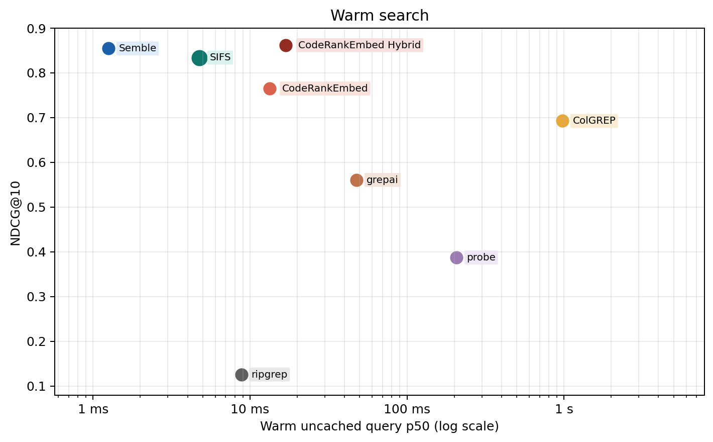
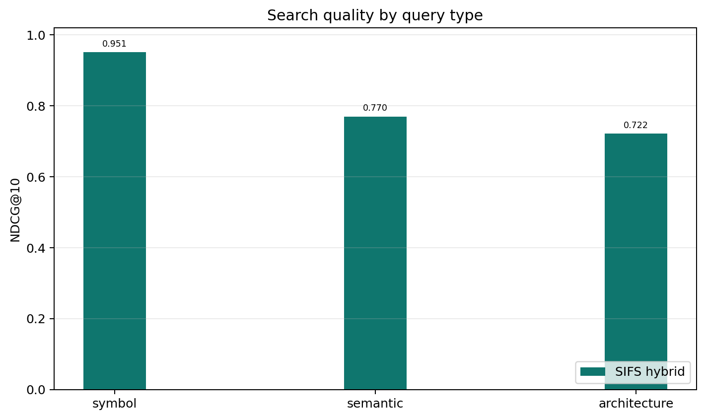
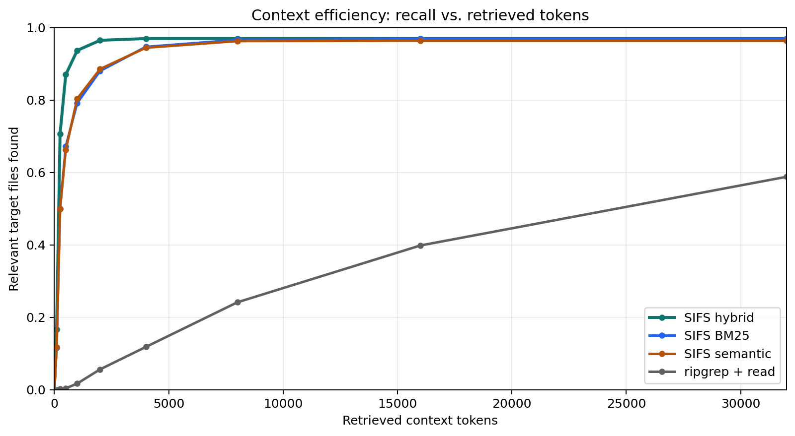

<p align="center">
  
</p>

<h2 align="center">Fast Code Search for Agents</h2>

<p align="center">
  <a href="https://crates.io/crates/sifs"></a>
  <a href="https://github.com/tristanmanchester/sifs/blob/main/LICENSE"></a>
</p>

<p align="center">
  <a href="#quickstart">Quickstart</a> •
  <a href="#agent-integration">Agent Integration</a> •
  <a href="#mcp-server">MCP Server</a> •
  <a href="#cli">CLI</a> •
  <a href="#rust-library">Rust Library</a> •
  <a href="#benchmarks">Benchmarks</a>
</p>

SIFS (SIFS Is Fast Search) is a local code-search engine for AI coding agents
and the developers who work through them. Point it at a repository and ask
questions like "where is authentication handled?", "what validates session
tokens?", or "which code builds the MCP handshake?". SIFS returns ranked file
paths, line ranges, and code chunks fast enough for an agent to search before
reading half the tree.

It runs as a CLI, a Rust crate, or a local MCP server. BM25 mode runs offline
with no model files; hybrid and semantic modes run locally once the embedding
model is cached.

Across 63 repositories and 1,251 annotated tasks, SIFS builds a cold sparse
index in 167 ms, answers warm queries in 2.7 ms, and scores NDCG@10 = 0.8471.

Use SIFS to:

- Find the code behind a natural-language question.
- Look up exact symbols and identifiers without warming an IDE.
- Hand an LLM a compact context pack instead of a whole repository.
- Give Codex, Claude Code, Cursor, OpenClaw, Hermes, or another agent a search
  tool it can call before broad file reads.

## Quickstart

Install SIFS with Homebrew:

```bash
brew install tristanmanchester/tap/sifs
```

Or install it with Cargo:

```bash
cargo install --locked sifs
```

Then search any local project:

```bash
cd /path/to/project
sifs search "where is authentication handled" --mode bm25 --offline --limit 5
```

BM25 mode runs offline with no model download. Results include the matching
file, line range, score, ranking mode, and code chunk.

For semantic search, cache the local model and use the default hybrid mode:

```bash
sifs model pull
sifs search "what checks whether a session is expired" --limit 5
sifs pack "how login sessions are created and validated" --budget-tokens 6000 --json
```

The default search mode is `hybrid` (semantic + BM25). Omit `--source` to search
the current directory, or pass a local path or Git URL explicitly:

```bash
sifs search "parse JWT claims" --source /path/to/project --mode bm25 --offline --limit 10
sifs symbol SessionToken --source /path/to/project --offline --json
sifs outline src/auth/session.rs --source /path/to/project --offline \
  --symbols-limit 200 --chunks-limit 100 --json
sifs find-related src/auth/session.rs 42 --source /path/to/project --limit 8
sifs search "stream upload backpressure" --source https://github.com/owner/project --limit 5
```

Common entry points:

| Goal | Command |
| --- | --- |
| Search without downloads | `sifs search "query" --mode bm25 --offline` |
| Use semantic + lexical ranking | `sifs model pull`, then `sifs search "query"` |
| Build an offline context pack | `sifs pack "query" --mode bm25 --offline --budget-tokens 6000 --json` |
| Build a hybrid context pack | `sifs model pull`, then `sifs pack "query" --budget-tokens 6000 --json` |
| Inspect what was indexed | `sifs status --json`, `sifs list-files --json`, `sifs symbol <name> --json`, `sifs outline <file> --json` |
| Teach an agent to use SIFS | `sifs agent install --target codex --artifact snippet --file AGENTS.md` |

## Agent integration

SIFS is most useful when agents know they can search first. Install a project
instruction snippet or local skill so Codex, Claude Code, OpenClaw, Hermes, or
any skill-aware agent uses SIFS before broad file reads:

```bash
sifs agent print --target codex --artifact snippet
sifs agent install --target codex --artifact snippet --file AGENTS.md --dry-run --json
sifs agent install --target codex --artifact snippet --file AGENTS.md
sifs agent doctor --target codex --json
```

Generated guidance is CLI-first. Agents use MCP tools when they're visible in
the current session and otherwise fall back to shell commands like `sifs
search`, `sifs pack`, `sifs list-files`, `sifs get`, and `sifs agent-context
--json`.

Full integration reference: [docs/agent-integration.md](docs/agent-integration.md).

## Features

- **Fast local search.** 167 ms cold sparse index, 2.7 ms warm query, 4.9 µs cached repeat. Rust, CPU-only.
- **Strong cross-language quality.** NDCG@10 of 0.8471 across 63 repositories, 19 languages, and 1,251 annotated tasks.
- **Three search modes.** `hybrid` for most queries, `semantic` for natural language, `bm25` for symbols and identifiers. Switch per query.
- **Offline-capable.** BM25 needs no model. Hybrid and semantic work offline once the model is cached.
- **MCP server.** Stdio server for Claude Code, Codex, Cursor, and any MCP-compatible agent. Sources index on demand and refresh on request.
- **Structural inspection.** Browse indexed paths, symbols, file outlines, chunks, related code, and context packs.
- **Agent skills and snippets.** Render, install, inspect, and remove SIFS guidance with `sifs agent`.
- **Local and remote sources.** Pass a local path or Git URL with `--source`.
- **Machine-readable contract.** `sifs agent-context --json` describes every command, flag, and tool.
- **Profiles and feedback.** Save defaults for repeated sessions and log friction with `sifs feedback`.
- **Benchmark diagnostics.** Run quality and latency benchmarks with the `diagnostics` feature.

## Install

```bash
# crates.io
cargo install --locked sifs

# Homebrew
brew install tristanmanchester/tap/sifs

# From source
cargo build --release
target/release/sifs search "authentication flow" --source . --mode bm25 --offline
```

Keep installed binaries current with:

```bash
sifs update --check
sifs update --dry-run
sifs update
```

`sifs update` delegates to Cargo or Homebrew only when the current binary is
owned by that package manager. For copied, development, or ambiguous binaries,
it prints manual next actions rather than touching an unrelated install.

The `sifs-benchmark` and `sifs-embed` diagnostic binaries require the `diagnostics` feature:

```bash
cargo build --release --features diagnostics --bins
```

Run the test suite after changing indexing, chunking, ranking, model loading, or MCP behavior:

```bash
cargo test
```

## MCP server

Install SIFS as a local stdio MCP server in two commands:

```bash
sifs daemon install-agent
sifs mcp install --client all
```

This registers a reusable server. Tool calls pass `source` to target a specific
local checkout or Git URL.

To pin the server to a single source:

```bash
sifs mcp install --client all --source /path/to/project
sifs mcp install --client codex --source /path/to/project
sifs mcp install --client claude --scope local --source /path/to/project
```

You can also start the server directly. Without `--source`, the server uses
its working directory as the default. Passing `--source` pins the server to
that source, so MCP clients can call `search` and `find_related` without
sending a source on every tool call.

```bash
sifs mcp
sifs mcp --source /path/to/project
```

The installer calls the client CLIs when they're available:

```bash
codex mcp add sifs -- /absolute/path/to/sifs mcp
claude mcp add-json sifs '{"type":"stdio","command":"/absolute/path/to/sifs","args":["mcp"],"env":{}}' --scope local
```

If a client CLI isn't available, `sifs mcp install --dry-run` prints the config to paste manually.

<details>
<summary><b>Manual config snippets</b></summary>

**Codex** (`~/.codex/config.toml`):
```toml
[mcp_servers.sifs]
command = "/absolute/path/to/sifs"
args = ["mcp"]
startup_timeout_sec = 20
tool_timeout_sec = 60
```

**Claude Code** (`.mcp.json` in your project):
```json
{
  "mcpServers": {
    "sifs": {
      "type": "stdio",
      "command": "/absolute/path/to/sifs",
      "args": ["mcp"],
      "env": {}
    }
  }
}
```

Only commit a project-scoped `.mcp.json` to repositories you trust. It grants read access to whatever local paths tool calls pass in.

</details>

To run the daemon directly:

```bash
sifs daemon run --replace-existing-socket
sifs daemon ping
sifs daemon status --json
```

## CLI

```bash
# Search the current directory
sifs search "where is authentication handled"

# Search a local project with hybrid ranking
sifs search "parse oauth callback" --source /path/to/project --mode hybrid --limit 10

# Use model-free offline BM25 search
sifs search "SessionToken" --source /path/to/project --mode bm25 --offline --limit 10

# Search a remote Git repository
sifs search "stream upload backpressure" --source https://github.com/owner/project

# Find code related to a known location
sifs find-related src/auth/session.rs 42 --source /path/to/project --limit 8
```

Use `--json`, `--jsonl`, or `--format` for structured output. Use
`--language`, `--filter-path`, and `--context-lines` when an agent needs
narrower results.

Use profiles for repeated agent sessions:

```bash
sifs profile save current --source /path/to/project --mode bm25 --offline --json
sifs search "mcp startup" --profile current --json
```

Index caches live in platform cache directories by default (`~/Library/Caches/sifs` on macOS, `${XDG_CACHE_HOME:-~/.cache}/sifs` on Linux). Override with `--cache-dir`, disable with `--no-cache`, or opt into a repo-local `.sifs/` cache with `--project-cache`.

Full CLI reference: [docs/cli.md](docs/cli.md).

## Platform support

Direct CLI search, library use, and MCP stdio work on macOS and Linux. The
shared `sifs daemon` uses same-user Unix sockets, so daemon mode runs on Unix
only. On Windows, use direct CLI or MCP stdio. `sifs doctor --json` reports
daemon platform status.

## Rust library

```rust
use sifs::{SearchMode, SearchOptions, SifsIndex};

fn main() -> anyhow::Result<()> {
    let index = SifsIndex::from_path("/path/to/project")?;
    let results = index.search_with(
        "where is authentication handled",
        &SearchOptions::new(5).with_mode(SearchMode::Hybrid),
    )?;

    for result in results {
        println!("{} {}", result.chunk.location(), result.score);
    }

    Ok(())
}
```

Use `SifsIndex::from_path_sparse` for a BM25-only index that never touches semantic state. Use `SifsIndex::from_git` for remote repositories. Full API docs, model policy, filters, and chunk-level construction: [docs/library.md](docs/library.md).

## How it works

SIFS walks a repo with `.gitignore`-aware file selection, splits files into code chunks, builds a sparse BM25 index, and loads semantic state lazily when a semantic or hybrid query needs it.

**`bm25`** — sparse lexical search. Good for identifiers, symbols, and exact terms. No model files required.

**`semantic`** — embedding similarity using `minishlab/potion-code-16M` through a local Model2Vec loader. Tensors and tokenizer files load directly into the Rust process and stay on the machine.

**`hybrid`** — the default. Semantic and BM25 rankings fuse with reciprocal rank fusion, then rerank. Symbol-like queries lean on BM25; natural-language questions keep more semantic weight.

<details>
<summary><b>Ranking signals</b></summary>

- **Query-aware mode weighting.** Symbol queries (`Foo::bar`, `getUserById`) get more BM25 weight. Natural-language queries stay balanced.
- **Definition boosts.** A chunk that defines the queried symbol (`class`, `fn`, `def`) ranks above chunks that only reference it.
- **Identifier stemming.** Query tokens are stemmed and matched against identifier stems, so `parse config` boosts chunks containing `parseConfig`, `ConfigParser`, or `config_parser`.
- **File coherence.** When multiple chunks from the same file match, the file is boosted so results reflect file-level relevance.
- **Noise penalties.** Test files, `compat/`/`legacy/` shims, example code, and `.d.ts` stubs are down-ranked so canonical implementations surface first.

</details>

Use `sifs model pull` (or its alias `sifs model fetch`) to pre-download the default model. Use `sifs doctor` to confirm semantic search is ready for offline use.

## Benchmarks

Benchmarks run across 63 pinned open-source repositories, 19 languages, and 1,251 annotated search tasks.



| Method | NDCG@10 | Cold index | Warm query | Cached repeat |
|---|---:|---:|---:|---:|
| CodeRankEmbed Hybrid | 0.8617 | 57.3 s | 16.9 ms | n/a |
| Semble | 0.8544 | 439.4 ms | 1.3 ms | n/a |
| **SIFS** | **0.8471** | **167.0 ms** | **2.7 ms** | **0.0049 ms** |
| CodeRankEmbed | 0.7648 | 57.3 s | 13.3 ms | n/a |
| ColGREP | 0.6925 | 3.9 s | 979.3 ms | n/a |
| grepai | 0.5606 | 35.0 s | 47.7 ms | n/a |
| probe | 0.3872 | — | 207.1 ms | n/a |
| ripgrep | 0.1257 | — | 8.8 ms | n/a |

SIFS reports separate timing fields so caching effects stay legible:

- `cold_index_ms` — fresh sparse/chunk index, no persistent cache
- `cold_semantic_build_or_load_ms` — first semantic embedding build or load
- `cold_first_search_ms` — first search, including semantic first-use cost
- `warm_uncached_query_ms` — normal query after the index exists (use this for comparisons)
- `warm_cached_repeat_query_ms` — repeated identical query in the same process

### Quality by query type

SIFS is strongest on symbol queries but holds up well on semantic and architecture questions too.

| Query type | NDCG@10 |
|---|---:|
| symbol | 0.9711 |
| semantic | 0.8412 |
| architecture | 0.7857 |



### Context efficiency

The chart below tracks how quickly annotated relevant files enter an agent's context as retrieved chunks are added to the prompt budget.



Full methodology, per-language breakdown, ablations, and benchmark artifacts: [docs/benchmark-report.md](docs/benchmark-report.md).

## File coverage

SIFS indexes code files by default and skips generated files, dependency directories, and caches. It uses the `ignore` crate, so `.gitignore` files, Git excludes, global ignores, and hidden files behave the same as in ripgrep or fd.

Recognized extensions: Python, JavaScript, TypeScript, Go, Rust, Java, Kotlin, Ruby, PHP, C, C++, C#, Swift, Scala, Elixir, Dart, Lua, SQL, Bash, Zig, Haskell, Markdown, YAML, TOML, JSON.

Pass `--include-docs` to add Markdown, YAML, TOML, JSON, and plain text. Use `--extension` (repeatable) to add custom file types.

## Documentation

- [CLI usage](docs/cli.md) — every command and flag
- [Rust library](docs/library.md) — `SifsIndex`, search modes, filters, indexing options
- [MCP server](docs/mcp.md) — stdio protocol and tool schemas
- [Agent-native scorecard](docs/agent-native-scorecard.md) — agent-facing contract and readiness evidence
- [Benchmarking](docs/benchmarks.md) — quality, latency, embedding, and smoke benchmarks
- [Architecture](docs/architecture.md) — file selection, chunking, embedding, sparse search, dense search, hybrid ranking

## License

MIT
