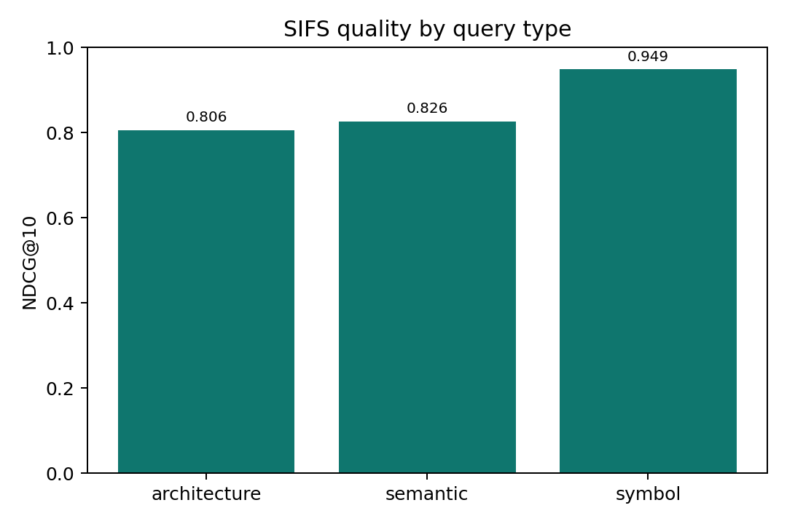

# SIFS benchmark report

These measurements were collected on May 4, 2026, on this development machine.
They are intended to make local tradeoffs visible, not to define a
hardware-independent performance contract.

## Summary

SIFS was evaluated against 63 pinned open-source repositories, 19 languages, and
1,251 annotated search tasks. The benchmark reports NDCG@10 for ranking quality
and three separate timing fields:

```text
cold_index_ms
warm_uncached_query_ms
warm_cached_repeat_query_ms
```

The uncached warm query number bypasses SIFS's in-process query-result cache and
is the honest value to compare for normal searches after an index exists. The
cached repeat number measures identical repeated queries after one warm-up.

| Method | NDCG@10 | Cold index | Warm uncached query | Cached repeat query |
|---|---:|---:|---:|---:|
| CodeRankEmbed Hybrid | 0.8617 | 57.3 s | 16.9 ms | n/a |
| Semble | 0.8544 | 439.4 ms | 1.3 ms | n/a |
| **SIFS** | **0.8426** | **119.9 ms** | **0.442 ms** | **0.0012 ms** |
| CodeRankEmbed | 0.7648 | 57.3 s | 13.3 ms | n/a |
| ColGREP | 0.6925 | 3.9 s | 979.3 ms | n/a |
| grepai | 0.5606 | 35.0 s | 47.7 ms | n/a |
| probe | 0.3872 | 0.0000 ms | 207.1 ms | n/a |
| ripgrep | 0.1257 | 0.0000 ms | 8.8 ms | n/a |

SIFS is third on raw NDCG@10 in this comparison. It is 0.0118 NDCG@10 behind
Semble and 0.0191 behind CodeRankEmbed Hybrid. The speed story is still strong,
but the meaningful warm-query figure is `0.442ms`, not the `0.0012ms` cached
repeat path.

## Figures




## Methodology

The SIFS result was generated with the Rust benchmark binary against the
annotated pinned-repository corpus:

```bash
cargo build --release --features diagnostics --bins
target/release/sifs-benchmark \
  --benchmarks-dir /path/to/benchmark-corpus \
  --bench-root /path/to/pinned-checkouts \
  --output benchmarks/results/sifs-full.json \
  --no-download
```

The comparison baselines are existing result JSON files from the adjacent Python
tool checkout. The Semble row is included as a direct comparison to that tool.

| Method | Source result file |
|---|---|
| Semble | `semble-hybrid-0332378809c5.json` |
| CodeRankEmbed Hybrid | `coderankembed-0332378809c5.json` |
| CodeRankEmbed | `coderankembed-0332378809c5.json` |
| ColGREP | `colgrep-c8a40fab2235.json` |
| grepai | `grepai-715563a812c3.json` |
| probe | `probe-715563a812c3.json` |
| ripgrep | `ripgrep-fixed-strings-0332378809c5.json` |

Cold latency in the figures is cold index time plus warm uncached query p50.
Warm latency is warm uncached query p50 with an existing index. Some baseline
files only carry precomputed summary timing fields; those values are preserved
rather than recomputed.

The full SIFS payload is checked in at
[benchmarks/results/sifs-full.json](../benchmarks/results/sifs-full.json). It
contains per-repository NDCG, latency, index time, memory, file count, chunk
count, and category-level scores.

## SIFS by language

| Language | Repos | Tasks | NDCG@10 | Warm uncached query | Cached repeat query |
|---|---:|---:|---:|---:|---:|
| bash | 3 | 60 | 0.8491 | 0.228 ms | 0.0011 ms |
| c | 3 | 60 | 0.7413 | 0.569 ms | 0.0011 ms |
| cpp | 3 | 60 | 0.8972 | 0.422 ms | 0.0011 ms |
| csharp | 3 | 60 | 0.8765 | 0.793 ms | 0.0011 ms |
| elixir | 3 | 58 | 0.8864 | 0.300 ms | 0.0014 ms |
| go | 3 | 58 | 0.8783 | 0.300 ms | 0.0012 ms |
| haskell | 3 | 60 | 0.7833 | 0.497 ms | 0.0011 ms |
| java | 3 | 61 | 0.8231 | 0.654 ms | 0.0012 ms |
| javascript | 3 | 60 | 0.8585 | 0.194 ms | 0.0011 ms |
| kotlin | 3 | 60 | 0.8094 | 0.484 ms | 0.0013 ms |
| lua | 3 | 60 | 0.8305 | 0.369 ms | 0.0011 ms |
| php | 3 | 60 | 0.8253 | 0.396 ms | 0.0011 ms |
| python | 9 | 184 | 0.8582 | 0.287 ms | 0.0011 ms |
| ruby | 3 | 58 | 0.8833 | 0.268 ms | 0.0011 ms |
| rust | 3 | 60 | 0.8029 | 0.509 ms | 0.0012 ms |
| scala | 3 | 59 | 0.8930 | 0.558 ms | 0.0012 ms |
| swift | 3 | 53 | 0.8599 | 0.564 ms | 0.0012 ms |
| typescript | 3 | 60 | 0.7248 | 0.711 ms | 0.0011 ms |
| zig | 3 | 60 | 0.9040 | 0.609 ms | 0.0011 ms |

## SIFS by query category

| Category | NDCG@10 |
|---|---:|
| architecture | 0.8063 |
| semantic | 0.8264 |
| symbol | 0.9486 |

Symbol lookup is the strongest category. BM25 and query-aware boosts help exact
identifiers while semantic retrieval handles natural-language discovery.

## TypeScript relevance work

TypeScript remains the weakest language slice in the full benchmark:
`NDCG@10=0.7248` across 60 tasks. A checked-in mini corpus now covers React
components, hooks, type definitions, barrel exports, `.d.ts` declarations,
route files, and test/spec files:

- [tests/fixtures/ts-mini-corpus](../tests/fixtures/ts-mini-corpus)
- [tests/typescript_relevance.rs](../tests/typescript_relevance.rs)

The suite intentionally keeps the test/spec-file query at a looser rank
threshold because current ranking penalizes test files. That makes the weakness
visible before changing global ranking.

## Large repository smoke test

A separate smoke benchmark can be run against a shallow clone of
`https://github.com/facebook/react`. This is not an annotated relevance test; it
is a scale and latency check on a larger real-world repository.

```bash
cargo build --release --example bench
target/release/examples/bench \
  /path/to/react \
  "how React schedules updates and work loops" \
  100
```

Current checked-in result:

```text
cold_index_ms=2137.435 warm_uncached_query_ms=2.053 warm_uncached_query_p90_ms=2.322 warm_cached_repeat_query_ms=0.001 warm_cached_repeat_query_p90_ms=0.001 peak_rss_mb=461.9 files=4370 chunks=21096
```

The captured output is checked in at
[benchmarks/results/react-smoke.txt](../benchmarks/results/react-smoke.txt).

## Reproducing the graphs

The plotting script used for these graphs is checked in at
[benchmarks/plot_sifs_comparison.py](../benchmarks/plot_sifs_comparison.py). It
was run with `uv`:

```bash
uv run --with matplotlib \
  benchmarks/plot_sifs_comparison.py \
  --sifs-result benchmarks/results/sifs-full.json
```

The generated PNGs are written into [assets/images](../assets/images), and a
compact generated table is written to
[benchmarks/README.generated.md](../benchmarks/README.generated.md).

The context-efficiency figure is generated from
[benchmarks/results/sifs-context-curves.json](../benchmarks/results/sifs-context-curves.json),
a compact summary of context-mode benchmark runs for SIFS hybrid, BM25, and
semantic search.
