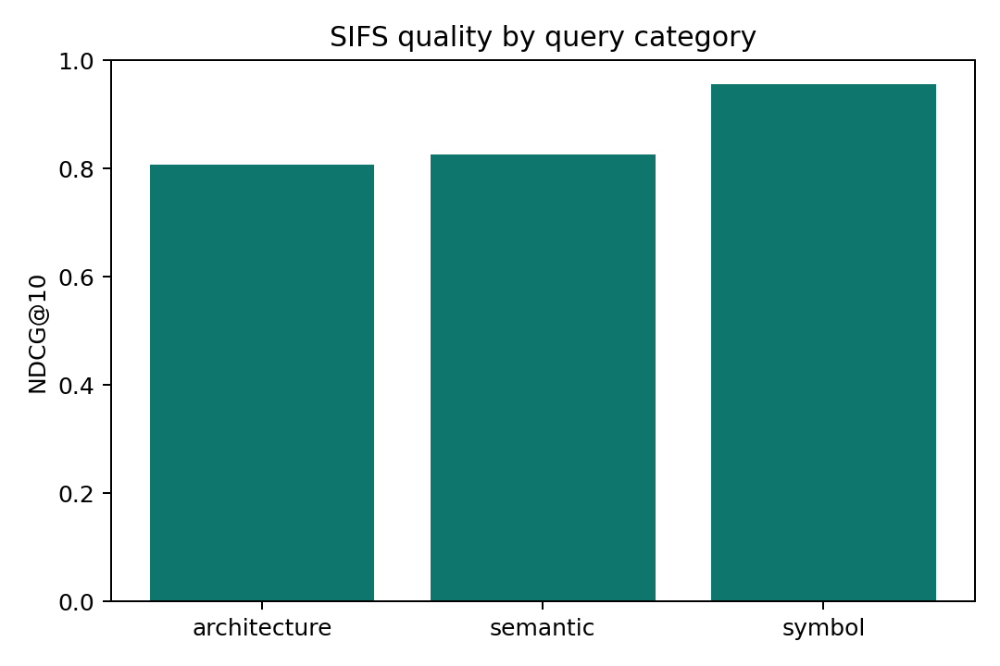

# SIFS Benchmark Report

These measurements were collected on May 4, 2026, on this development machine.
They are intended to make local tradeoffs visible, not to define a
hardware-independent performance contract.

## Summary

SIFS was evaluated against the Semble benchmark corpus: 63 pinned open-source
repositories, 19 languages, and 1,251 annotated search tasks. The benchmark uses
NDCG@10 for ranking quality and repeated-query p50 latency for warm search.

| Method | NDCG@10 | Index time | Query p50 |
|---|---:|---:|---:|
| CodeRankEmbed Hybrid | 0.8617 | 57.3 s | 16.9 ms |
| semble | 0.8544 | 439.4 ms | 1.3 ms |
| **SIFS** | **0.8444** | **93.0 ms** | **0.0017 ms** |
| CodeRankEmbed | 0.7648 | 57.3 s | 13.3 ms |
| ColGREP | 0.6925 | 3.9 s | 979.3 ms |
| grepai | 0.5606 | 35.0 s | 47.7 ms |
| probe | 0.3872 | 0.0000 ms | 207.1 ms |
| ripgrep | 0.1257 | 0.0000 ms | 8.8 ms |

The main result is that SIFS lands close to the strongest semantic/hybrid
baselines while keeping indexing and warm-query latency very low. In this run,
SIFS was 0.0100 NDCG@10 behind Semble and 0.0173 behind CodeRankEmbed Hybrid,
with lower reported warm-query latency than every baseline in the comparison.

## Figures




## Methodology

The SIFS result was generated with the Rust benchmark binary against the Semble
benchmark annotations and pinned repositories:

```bash
cargo build --release
target/release/sifs-benchmark \
  --benchmarks-dir /Users/tristan/Projects/oss/semble-port/semble/benchmarks \
  --bench-root /Users/tristan/.cache/semble-bench \
  --latency-runs 5 \
  --output /Users/tristan/Projects/oss/semble-port/sifs-bench/results/sifs-full.json
```

The comparison baselines are the existing Semble result JSON files under
`/Users/tristan/Projects/oss/semble-port/semble/benchmarks/results`. The plotted
baseline files were:

| Method | Source result file |
|---|---|
| Semble | `semble-hybrid-0332378809c5.json` |
| CodeRankEmbed Hybrid | `coderankembed-0332378809c5.json` |
| CodeRankEmbed | `coderankembed-0332378809c5.json` |
| ColGREP | `colgrep-c8a40fab2235.json` |
| grepai | `grepai-715563a812c3.json` |
| probe | `probe-715563a812c3.json` |
| ripgrep | `ripgrep-fixed-strings-0332378809c5.json` |

Cold latency in the figures is index time plus first-query latency. Warm latency
is the reported query p50 with an existing index. Some baseline files only carry
precomputed summary timing fields; those values are preserved rather than
recomputed.

The full SIFS payload is checked in at
[benchmarks/results/sifs-full.json](../benchmarks/results/sifs-full.json). It
contains per-repository NDCG, latency, index time, memory, file count, chunk
count, and category-level scores.

## SIFS By Language

| Language | Repos | Tasks | NDCG@10 | Query p50 |
|---|---:|---:|---:|---:|
| bash | 3 | 60 | 0.8524 | 0.0016 ms |
| c | 3 | 60 | 0.7668 | 0.0016 ms |
| cpp | 3 | 60 | 0.8890 | 0.0016 ms |
| csharp | 3 | 60 | 0.8776 | 0.0016 ms |
| elixir | 3 | 58 | 0.8926 | 0.0020 ms |
| go | 3 | 58 | 0.8654 | 0.0017 ms |
| haskell | 3 | 60 | 0.7944 | 0.0016 ms |
| java | 3 | 61 | 0.8075 | 0.0017 ms |
| javascript | 3 | 60 | 0.8513 | 0.0016 ms |
| kotlin | 3 | 60 | 0.7941 | 0.0020 ms |
| lua | 3 | 60 | 0.8468 | 0.0016 ms |
| php | 3 | 60 | 0.8323 | 0.0017 ms |
| python | 9 | 184 | 0.8598 | 0.0016 ms |
| ruby | 3 | 58 | 0.8927 | 0.0016 ms |
| rust | 3 | 60 | 0.8085 | 0.0017 ms |
| scala | 3 | 59 | 0.8908 | 0.0017 ms |
| swift | 3 | 53 | 0.8716 | 0.0016 ms |
| typescript | 3 | 60 | 0.7219 | 0.0017 ms |
| zig | 3 | 60 | 0.9050 | 0.0016 ms |

## SIFS By Query Category

| Category | Repos | NDCG@10 |
|---|---:|---:|
| architecture | 63 | 0.8070 |
| semantic | 63 | 0.8262 |
| symbol | 50 | 0.9566 |

Symbol lookup is the strongest category, which matches SIFS's hybrid design:
BM25 and query-aware boosts help exact identifiers while semantic retrieval
keeps natural-language discovery competitive.

## Large Repository Smoke Test

A separate smoke benchmark was run against a shallow clone of
`https://github.com/facebook/react`. This is not an annotated relevance test; it
is a scale and latency check on a larger real-world repository.

```bash
git clone --depth 1 https://github.com/facebook/react.git \
  /Users/tristan/Projects/oss/semble-port/sifs-bench/repos/react

cargo build --release --example bench
target/release/examples/bench \
  /Users/tristan/Projects/oss/semble-port/sifs-bench/repos/react \
  "how React schedules updates and work loops" \
  100
```

Result:

```text
index_ms=8289.240 query_p50_ms=0.002 query_p90_ms=0.003 peak_rss_mb=362.8 files=4373 chunks=21117
```

The captured output is checked in at
[benchmarks/results/react-smoke.txt](../benchmarks/results/react-smoke.txt).

## Reproducing The Graphs

The plotting script used for these graphs is checked in at
[benchmarks/plot_sifs_comparison.py](../benchmarks/plot_sifs_comparison.py). It
expects the Semble baseline result files to exist in the adjacent
`../semble/benchmarks/results` checkout by default, and it was run with `uv`:

```bash
uv run --with matplotlib --with numpy python \
  benchmarks/plot_sifs_comparison.py \
  --sifs-result benchmarks/results/sifs-full.json
```

The generated PNGs are written into [assets/images](../assets/images), and a
compact generated table is written to
[benchmarks/README.generated.md](../benchmarks/README.generated.md).

## Interpretation Notes

- SIFS reports very low repeated-query latency because the benchmark measures
  repeated searches against an already built in-process index, and repeated
  identical searches hit the SIFS query cache.
- Index timing is averaged across the annotated benchmark repositories. It is
  best compared against methods measured through the same Semble benchmark
  harness and result files.
- The React smoke test gives a more concrete large-repository cold-index number:
  about 8.29 seconds for 4,373 files and 21,117 chunks on this machine.
- TypeScript is the weakest language slice in this run. It is a good target for
  future chunking and ranking work because the same corpus also showed strong
  results for JavaScript, Python, Ruby, Scala, Zig, Swift, and C++.
