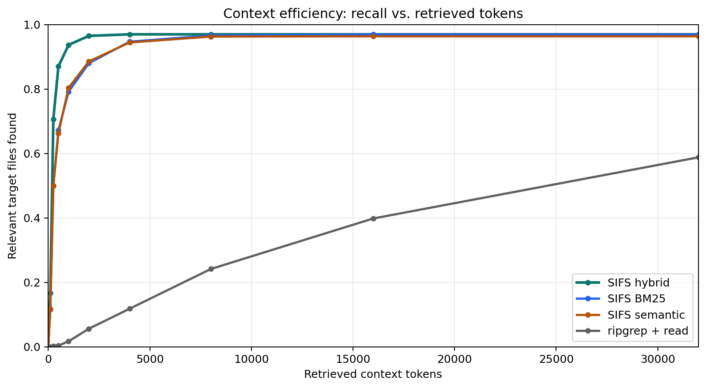
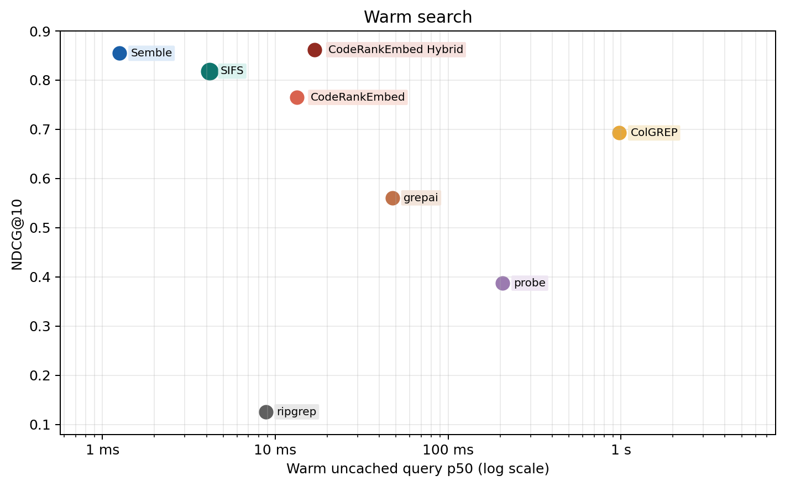
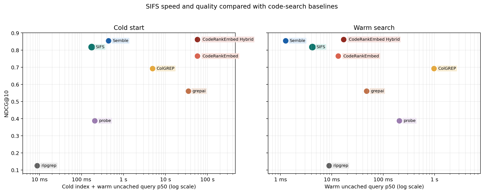
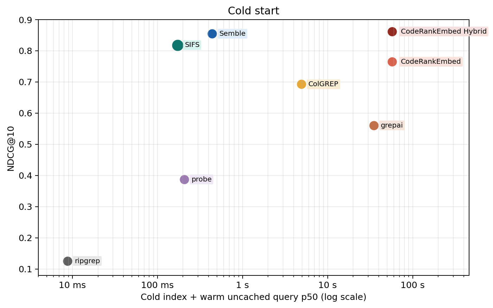
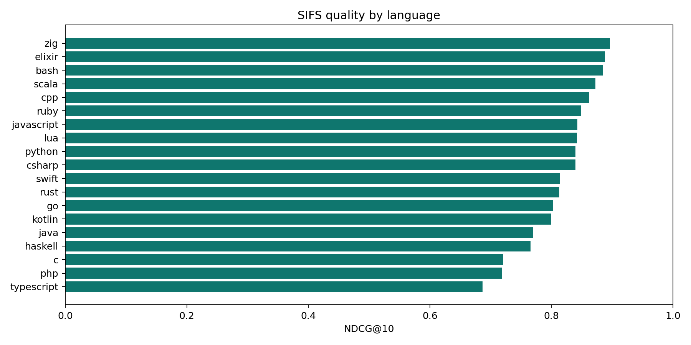

# SIFS benchmark report

These measurements were collected on May 7, 2026, on this development machine.
They are intended to make local tradeoffs visible, not to define a
hardware-independent performance contract.

## Summary

SIFS was evaluated against 63 pinned open-source repositories, 19 languages, and
1,251 annotated search tasks. The benchmark reports NDCG@10 for ranking quality
and separate timing fields for cold indexing, semantic first use, warm queries,
and cached repeats:

```text
cold_index_ms
cold_semantic_build_or_load_ms
cold_first_search_ms
warm_uncached_query_ms
warm_cached_repeat_query_ms
```

The uncached warm query number bypasses SIFS's in-process query-result cache and
is the honest value to compare for normal searches after an index exists. The
cached repeat number measures identical repeated queries after one warm-up.
`cold_index_ms` is sparse/chunk index construction only; semantic/hybrid
first-use cost is reported separately as `cold_semantic_build_or_load_ms` and
included in `cold_first_search_ms`.

| Method | NDCG@10 | Cold index | Warm uncached query | Cached repeat query |
|---|---:|---:|---:|---:|
| CodeRankEmbed Hybrid | 0.8617 | 57.3 s | 16.9 ms | n/a |
| Semble | 0.8544 | 439.4 ms | 1.3 ms | n/a |
| **SIFS** | **0.8181** | **168.8 ms** | **4.2 ms** | **0.0054 ms** |
| CodeRankEmbed | 0.7648 | 57.3 s | 13.3 ms | n/a |
| ColGREP | 0.6925 | 3.9 s | 979.3 ms | n/a |
| grepai | 0.5606 | 35.0 s | 47.7 ms | n/a |
| probe | 0.3872 | 0.0000 ms | 207.1 ms | n/a |
| ripgrep | 0.1257 | 0.0000 ms | 8.8 ms | n/a |

SIFS remains substantially faster to build and query than the neural embedding
baselines while landing behind CodeRankEmbed Hybrid and Semble on raw NDCG@10
in this regenerated run. The speed story also stays explicit: the meaningful
warm-query figure is `4.2ms`, not the `0.0054ms` cached repeat path.

## Figures













## Methodology

The SIFS result was generated with the Rust benchmark binary against the
annotated pinned-repository corpus:

```bash
cargo build --release --features diagnostics --bins
target/release/sifs-benchmark \
  --benchmarks-dir /path/to/benchmark-corpus \
  --bench-root /path/to/pinned-checkouts \
  --output benchmarks/results/sifs-full.json \
  --no-download \
  --no-cache
```

For failure analysis, add `--include-tasks --candidate-diagnostics`. This emits
per-target final rank, BM25 rank, semantic rank, candidate-union presence, and a
coarse failure stage so candidate-generation misses can be separated from
reranking misses.

The comparison baselines are existing result JSON files from the adjacent Python
tool checkout. The Semble row is included as a direct comparison to that tool.

| Method | Source result file |
|---|---|
| Semble | `semble-hybrid-0332378809c5.json` |
| CodeRankEmbed Hybrid | `coderankembed-0332378809c5.json` |
| CodeRankEmbed | `coderankembed-0332378809c5.json` |
| ColGREP | `colgrep-c8a40fab2235.json` |
| grepai | `grepai-715563a812c3.json` |
| probe | `probe-715563a812c3.json` |
| ripgrep | `ripgrep-fixed-strings-0332378809c5.json` |

Cold latency in the figures is cold index time plus warm uncached query p50.
Warm latency is warm uncached query p50 with an existing index. Some baseline
files only carry precomputed summary timing fields; those values are preserved
rather than recomputed.

The full SIFS payload is checked in at
[benchmarks/results/sifs-full.json](../benchmarks/results/sifs-full.json). It
contains per-repository NDCG, latency, index time, memory, file count, chunk
count, and category-level scores.

The checked-in result JSON includes per-repository `reproducibility`,
`cold_semantic_build_or_load_ms`, and `cold_first_search_ms` fields. Fresh
release claims should be regenerated with the command above on the target
machine.

## SIFS by language

| Language | Repos | Tasks | NDCG@10 | Warm uncached query | Cached repeat query |
|---|---:|---:|---:|---:|---:|
| bash | 3 | 60 | 0.8844 | 1.331 ms | 0.0024 ms |
| c | 3 | 60 | 0.7201 | 9.153 ms | 0.0070 ms |
| cpp | 3 | 60 | 0.8614 | 5.160 ms | 0.0058 ms |
| csharp | 3 | 60 | 0.8397 | 4.758 ms | 0.0038 ms |
| elixir | 3 | 58 | 0.8880 | 2.113 ms | 0.0053 ms |
| go | 3 | 58 | 0.8029 | 1.439 ms | 0.0047 ms |
| haskell | 3 | 60 | 0.7655 | 4.412 ms | 0.0049 ms |
| java | 3 | 61 | 0.7697 | 10.255 ms | 0.0051 ms |
| javascript | 3 | 60 | 0.8425 | 0.523 ms | 0.0056 ms |
| kotlin | 3 | 60 | 0.7988 | 3.453 ms | 0.0048 ms |
| lua | 3 | 60 | 0.8419 | 3.580 ms | 0.0057 ms |
| php | 3 | 60 | 0.7183 | 6.557 ms | 0.0050 ms |
| python | 9 | 184 | 0.8397 | 1.367 ms | 0.0053 ms |
| ruby | 3 | 58 | 0.8483 | 1.096 ms | 0.0044 ms |
| rust | 3 | 60 | 0.8129 | 4.561 ms | 0.0060 ms |
| scala | 3 | 59 | 0.8722 | 3.564 ms | 0.0070 ms |
| swift | 3 | 53 | 0.8137 | 2.709 ms | 0.0053 ms |
| typescript | 3 | 60 | 0.6867 | 4.513 ms | 0.0069 ms |
| zig | 3 | 60 | 0.8965 | 13.790 ms | 0.0076 ms |

## SIFS by query category

| Category | NDCG@10 |
|---|---:|
| architecture | 0.7711 |
| semantic | 0.7920 |
| symbol | 0.9587 |

Symbol lookup is the strongest category. BM25 and query-aware boosts help exact
identifiers while semantic retrieval handles natural-language discovery.

## Language relevance work

TypeScript is now the weakest language slice in the full benchmark:
`NDCG@10=0.6867` across 60 tasks. PHP is `NDCG@10=0.7183`. A checked-in mini
corpus covers React components, hooks, type definitions, barrel exports,
`.d.ts` declarations, route files, and test/spec files:

- [tests/fixtures/ts-mini-corpus](../tests/fixtures/ts-mini-corpus)
- [tests/typescript_relevance.rs](../tests/typescript_relevance.rs)

The suite intentionally keeps the test/spec-file query at a looser rank
threshold because current ranking penalizes test files. That makes the weakness
visible before changing global ranking.

## Large repository smoke test

A separate smoke benchmark can be run against a shallow clone of
`https://github.com/facebook/react`. This is not an annotated relevance test; it
is a scale and latency check on a larger real-world repository.

```bash
cargo build --release --example bench
target/release/examples/bench \
  /path/to/react \
  "how React schedules updates and work loops" \
  100
```

Current checked-in result:

```text
cold_index_ms=2137.435 warm_uncached_query_ms=2.053 warm_uncached_query_p90_ms=2.322 warm_cached_repeat_query_ms=0.001 warm_cached_repeat_query_p90_ms=0.001 peak_rss_mb=461.9 files=4370 chunks=21096
```

The captured output is checked in at
[benchmarks/results/react-smoke.txt](../benchmarks/results/react-smoke.txt).

## Reproducing the graphs

The plotting script used for these graphs is checked in at
[benchmarks/plot_sifs_comparison.py](../benchmarks/plot_sifs_comparison.py). It
was run with `uv`:

```bash
uv run --with matplotlib \
  benchmarks/plot_sifs_comparison.py \
  --sifs-result benchmarks/results/sifs-full.json
```

The generated PNGs are written into [assets/images](../assets/images), and a
compact generated table is written to
[benchmarks/README.generated.md](../benchmarks/README.generated.md).

The query-type figure uses the current `--sifs-result` payload only. Historical
mode-ablation JSON files under `benchmarks/results/sifs-mode-*.json` should be
regenerated with the current benchmark binary and `--no-cache` before they are
used for fresh comparison claims.

The context-efficiency figure is generated from
[benchmarks/results/sifs-context-curves.json](../benchmarks/results/sifs-context-curves.json),
a compact summary of context-mode benchmark runs for SIFS hybrid, BM25,
semantic search, and `ripgrep + read`. The ripgrep curve is generated from
[benchmarks/ripgrep_context_curve.py](../benchmarks/ripgrep_context_curve.py).
That helper writes the ignored raw payload `benchmarks/results/ripgrep-context.json`,
then the plotting script compacts the curve into
`benchmarks/results/sifs-context-curves.json`. It splits each query into
keywords, drops stopwords and short words, runs fixed-string ripgrep per
keyword, ranks files by distinct keyword coverage, and charges the prompt
budget for reading the full matched files in rank order. Token counts for the
ripgrep curve use the `cl100k_base` tokenizer when regenerated with
`uv run --with tiktoken`.
