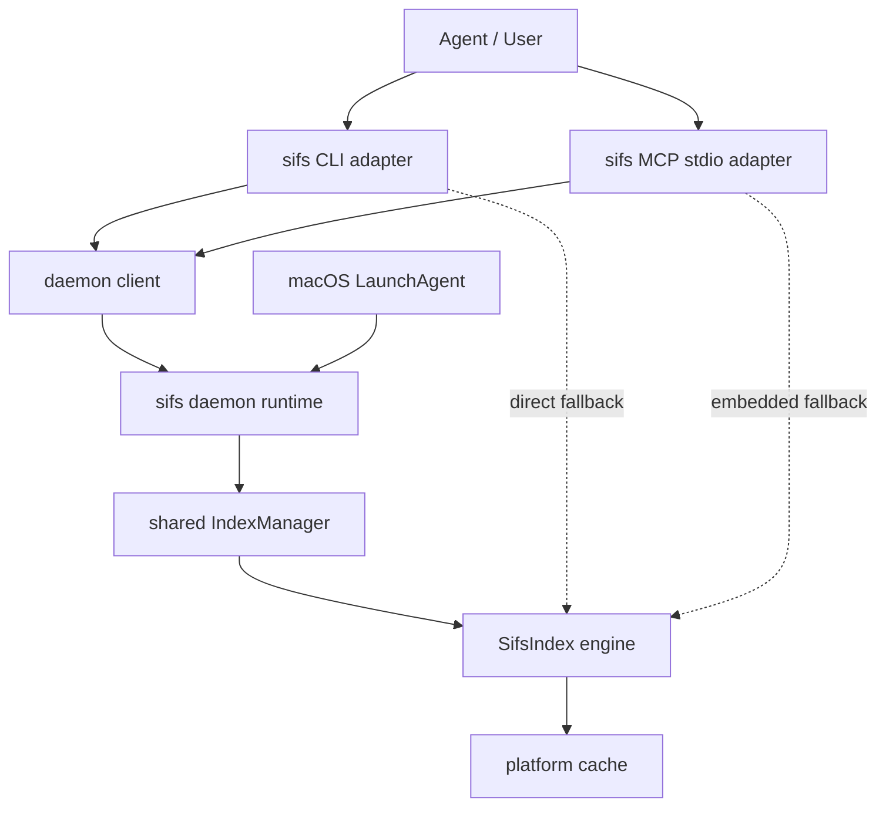
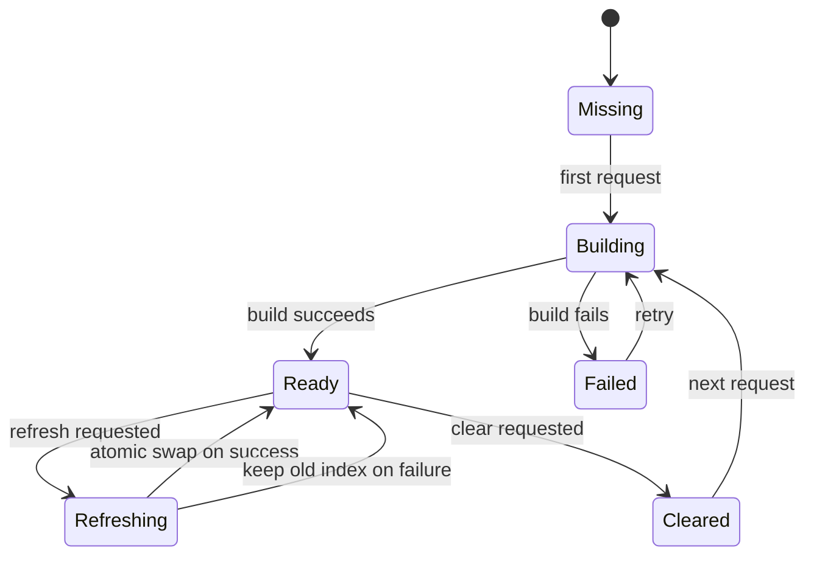
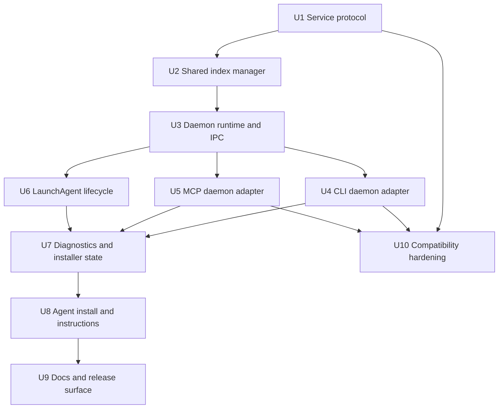
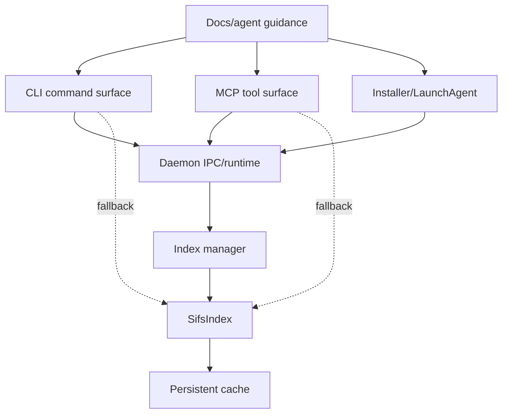

# feat: Build daemon-first agent search

## Summary

SIFS should become always-available local search infrastructure for agents: a daemon owns shared index lifecycle, cache warming, source state, and health, while CLI and MCP become thin adapters that use the daemon by default and preserve direct mode as a first-class fallback. This plan upgrades SIFS from a single-process CLI/MCP search tool into an install-once, daemon-backed search substrate that agents can use across arbitrary codebases.

---

## Problem Frame

SIFS is already fast and agent-facing, but its current runtime model is still process-local: direct CLI commands rebuild or reload indexes per invocation, and the MCP server shares in-memory indexes only within one stdio server process. That makes agents depend on per-client MCP setup, repeated `repo` discipline, explicit refreshes, and non-shared warm state. To build the best fast search for agents, SIFS needs a durable local runtime that all agents and clients can use.

---

## Requirements

- R1. SIFS must provide a long-running local daemon as the intended default runtime after setup, with shared in-memory indexes across CLI, MCP, and future local clients.
- R2. `SifsIndex` must remain the single search engine; daemon work must not fork ranking, chunking, cache validation, model loading, or result semantics into a second implementation.
- R3. CLI and MCP must preserve current direct-mode behavior, output contracts, and structured response shapes while adding daemon-backed execution.
- R4. Direct mode must remain explicit, testable, and usable when the daemon is unavailable, unsupported, version-mismatched, or intentionally disabled.
- R5. The daemon must expose a versioned local IPC protocol with structured request, response, error, and health metadata.
- R6. The daemon must deduplicate concurrent builds for the same index identity and protect refresh/build/clear/search from partial-state races.
- R7. Source identity must include source path or Git URL, ref, encoder/model policy, cache mode, extension/text/ignore options, and search capability so incompatible indexes are never reused.
- R8. The initial daemon must use explicit refresh and status/staleness reporting rather than file watching; watcher-based live refresh is deferred until the shared runtime is stable.
- R9. The installer must support macOS LaunchAgent lifecycle for the daemon while preserving a foreground `daemon run` mode for tests, debugging, and non-macOS use.
- R10. Install, status, doctor, dry-run, and uninstall flows must be machine-readable enough for agents to verify and repair setup without guessing.
- R11. MCP install and agent instructions must make SIFS feel installed once and usable everywhere, while keeping project/default-source MCP configuration available for compatibility.
- R12. The implementation must update user-facing docs, agent guidance, release checks, and changelog entries for the new daemon-first architecture.

---

## Scope Boundaries

- No cloud-hosted search service, team index server, or remote multi-user daemon.
- No arbitrary shell execution, write tools, or broad file-reading MCP additions beyond existing bounded search/chunk/file-list behavior.
- No ranking, benchmark, chunking, or model-quality redesign as part of this daemon plan.
- No filesystem watcher in the first daemon architecture; use explicit refresh plus status/staleness reporting.
- No LaunchDaemon/root install path in the initial daemon release; default to per-user LaunchAgent on macOS.
- No destructive uninstall by default; daemon uninstall must preserve model and index caches unless a separate explicit purge path is added.
- No change to Homebrew tests that requires model downloads, network access, user LaunchAgent loading, or a long-lived service.

### Deferred to Follow-Up Work

- Cross-platform service managers beyond macOS LaunchAgent: add Linux user systemd and Windows service support after the local service boundary is stable.
- Filesystem watching and background incremental refresh: add once daemon lifecycle, source identity, and atomic refresh semantics are proven.
- Durable Git checkout management for branch freshness: keep current Git cache semantics first, then design persistent clone storage separately if needed.
- Rich editor UI or dashboards: keep this plan focused on daemon, CLI, MCP, diagnostics, and docs.

---

## Context & Research

### Relevant Code and Patterns

- `src/index.rs` is the core search engine boundary. It owns `SifsIndex`, sparse and semantic state, file/language mappings, query cache, persistent cache metadata, and lazy semantic initialization.
- `src/mcp.rs` currently has an MCP-local `IndexCache` keyed by canonical local path or Git URL/ref. This is the closest existing shape to a daemon index manager, but it is tied to MCP request handling and should not become the daemon core unchanged.
- `src/main.rs` owns all CLI commands, MCP installer generation, doctor output, cache commands, and embedded agent-file generation.
- `src/types.rs` contains search-facing types, but there is no daemon protocol DTO boundary yet.
- `docs/architecture.md` explicitly describes SIFS as single-process and MCP-cached only for one server lifetime; this must change.
- `docs/mcp.md` documents stdio MCP and the explicit `refresh_index` requirement for long-lived sessions; daemon-backed MCP should preserve the tool contract while changing runtime ownership.
- `tests/cli.rs`, `tests/core.rs`, and `src/mcp.rs` unit tests already protect current CLI JSON/JSONL, MCP schemas, default source behavior, offline Git rejection, and cache behavior.
- `packaging/homebrew/sifs.rb` and `RELEASING.md` require offline, model-free package validation; daemon packaging must not make package tests depend on launchd or network/model availability.

### Institutional Learnings

- Treat "configured" and "visible to the agent" as separate installer states. Prior Codex Desktop work showed config files can look correct while the actual runtime tool surface is not visible until restart or cache materialization.
- Agent-native installer diagnostics need JSON/status surfaces. Prior local tooling work became reliable when `doctor --json`, dry-run resolution, and provider/status introspection were first-class.
- Long-running local workflows should separate cheap metadata status from blocking attach/log behavior. Daemon status should expose pid, socket, version, health, last error, and readiness without blocking on active work.
- macOS packaging must verify the installed artifact, not just the source template. LaunchAgent verification should inspect the actual plist, loaded state, resolved binary path, socket reachability, and process health.

### External References

- Claude Code supports local, project, and user MCP scopes; project scope writes `.mcp.json` in the project root and is team-shareable, while user scope loads across projects: [Claude Code MCP docs](https://code.claude.com/docs/en/mcp).
- Cursor supports global and project MCP config and workspace variables such as `${workspaceFolder}`: [Cursor MCP docs](https://docs.cursor.com/advanced/model-context-protocol).
- VS Code/Copilot supports user and workspace MCP configuration with `${workspaceFolder}` and sandbox/security controls: [VS Code MCP configuration](https://code.visualstudio.com/docs/copilot/reference/mcp-configuration).
- Codex supports MCP server definitions in `config.toml` with stdio transport, `cwd`, timeouts, and tool controls: [Codex MCP configuration](https://github.com/openai/codex/blob/main/docs/config.md).
- Semble, the sibling project inspected during planning, documents source-less MCP by default and expects agents to pass `repo` per call, while still optionally supporting a default source in its server implementation.

---

## Key Technical Decisions

| Decision | Rationale |
|----------|-----------|
| Make the daemon the intended default runtime after setup | The product goal is install-once, shared, warm, agent-available search infrastructure, not a per-session MCP cache. |
| Keep direct mode as a first-class fallback | Existing CLI/MCP behavior, package tests, CI, debugging, and unsupported service managers must keep working. |
| Keep `SifsIndex` as the only engine | Prevents divergent ranking/cache semantics and keeps benchmark/relevance guarantees attached to one implementation. |
| Use a versioned local JSON protocol over a user-owned Unix socket first | Matches the local-only Rust CLI/MCP use case, avoids HTTP service exposure, and is testable without async-heavy infrastructure. |
| Add daemon foreground mode before LaunchAgent install | `sifs daemon run` is required for tests, debugging, Linux/manual use, and deterministic service development. |
| Use explicit refresh and staleness/status signals before file watching | File watchers add platform churn, debounce semantics, battery/cpu concerns, and ignore-rule complexity; shared runtime should land before live refresh. |
| Preserve adapter-owned formatting | The daemon should return structured internal data; CLI and MCP should keep owning current human/JSON/JSONL/MCP formatting contracts. |
| Make fallback visible | Silent direct fallback would hide daemon breakage; human CLI should warn, JSON/status should expose runtime metadata where non-breaking, and MCP status should show adapter/runtime mode. |
| Treat install as a state machine | Payload, LaunchAgent plist, loaded service, running process, socket, healthy daemon, MCP config, and agent-visible tool surface are separate states. |

---

## Open Questions

### Resolved During Planning

- Should daemon be excluded as overkill? No. The user explicitly corrected the scope: SIFS is meant to become the best fast search for agents, so daemon-first local infrastructure is core scope.
- Should direct mode disappear? No. Direct mode remains required for portability, debugging, packaging, CI, service failure, and existing users.
- Should filesystem watching be part of the initial daemon? No. The first daemon should share and manage indexes safely; watcher-based live refresh is deferred.
- Should the daemon own the MCP protocol directly? No. MCP should remain an adapter. The daemon protocol should be local, stable, and client-agnostic.

### Deferred to Implementation

- Exact IPC framing details: choose newline-delimited JSON, length-prefixed JSON, or another simple framing while implementing the daemon protocol, as long as it is versioned and testable.
- Exact memory eviction thresholds: implement a bounded policy with status visibility, but tune limits after seeing real memory behavior.
- Exact status field names: define stable structured names during implementation and keep them consistent across `daemon status --json`, doctor, and adapter metadata.
- Exact LaunchAgent label and paths: choose during implementation, but verify installed artifact state directly.

---

## Output Structure

This tree shows the expected shape for new areas. It is a scope declaration, not a constraint; implementation may adjust names if a clearer module boundary emerges.

```text
src/
  daemon/
    mod.rs
    client.rs
    manager.rs
    protocol.rs
    runtime.rs
    launchd.rs
    paths.rs
    status.rs
  main.rs
  mcp.rs
  types.rs
tests/
  daemon.rs
  cli.rs
  core.rs
docs/
  daemon.md
  architecture.md
  cli.md
  mcp.md
  agent-native-scorecard.md
packaging/
  homebrew/
    sifs.rb
```

---

## High-Level Technical Design

> *This illustrates the intended approach and is directional guidance for review, not implementation specification. The implementing agent should treat it as context, not code to reproduce.*



Runtime mode comparison:

| Mode | Owner of warm state | Primary use | Failure behavior |
|------|---------------------|-------------|------------------|
| Daemon-backed | `sifs daemon run` / LaunchAgent | Default installed runtime for agents and users | Visible fallback or daemon-required failure |
| Direct CLI | Current CLI process | CI, debugging, fallback, package tests | Existing behavior |
| Embedded MCP | Current stdio MCP process | Compatibility when daemon is unavailable/disabled | Existing MCP cache behavior |

Daemon index lifecycle:



---

## Implementation Units



- U1. **Define daemon protocol and source identity**

**Goal:** Establish the local service contract that CLI, MCP, and future adapters will use without embedding CLI/MCP formatting into the daemon.

**Requirements:** R1, R3, R5, R7

**Dependencies:** None

**Files:**
- Create: `src/daemon/protocol.rs`
- Create: `src/daemon/paths.rs`
- Modify: `src/daemon/mod.rs`
- Modify: `src/types.rs`
- Test: `tests/daemon.rs`

**Approach:**
- Define request/response DTOs for current search surfaces: search, find-related, index status, refresh, clear, list indexed files, get chunk, daemon status, and shutdown/admin status if needed.
- Include protocol version, client binary version, source identity, request id, and runtime options in every request envelope.
- Make source identity broader than the current MCP key: local canonical path or Git URL/ref plus encoder/model policy, sparse/hybrid capability, cache mode, include-text/extensions/ignore options, offline/no-download policy, and Git ref.
- Keep daemon responses structured and formatting-neutral; adapters convert responses into existing CLI/MCP shapes.
- Use user-owned runtime paths for sockets and pid/status files; do not put runtime state into searched repositories by default.

**Patterns to follow:**
- `src/types.rs` for serializable search/result types.
- `src/mcp.rs` structuredContent construction as a compatibility target, not as the daemon protocol shape.
- `src/index.rs` `CacheContext` and cache identity logic for what must be represented in source identity.

**Test scenarios:**
- Happy path: local source identity for the same real path and symlink canonicalizes to one daemon source key.
- Happy path: Git URL with and without ref creates distinct source identities.
- Edge case: same local path with default model and hashing encoder creates distinct source identities.
- Edge case: same path with platform cache and `--no-cache` creates distinct identities or explicit non-cacheable behavior.
- Error path: protocol version mismatch decodes to a structured version mismatch response that adapters can handle.
- Error path: malformed request returns a structured daemon protocol error without panicking.

**Verification:**
- Protocol DTOs serialize/deserialize deterministically.
- Source identity tests prove incompatible index options cannot collide.
- No CLI or MCP human output formatting leaks into daemon DTOs.

---

- U2. **Extract shared index manager**

**Goal:** Move long-lived source/index lifecycle out of MCP-local `IndexCache` into a reusable daemon-ready manager while keeping `SifsIndex` as the only search engine.

**Requirements:** R1, R2, R6, R7, R8

**Dependencies:** U1

**Files:**
- Create: `src/daemon/manager.rs`
- Modify: `src/index.rs`
- Modify: `src/mcp.rs`
- Modify: `src/lib.rs`
- Test: `tests/daemon.rs`
- Test: `tests/core.rs`

**Approach:**
- Introduce an `IndexManager` that owns source-keyed index entries, build state, refresh state, last error, cache metadata, and semantic-loaded status.
- Reuse `SifsIndex::from_path_with_index_options` and `SifsIndex::from_git_with_index_options`; do not duplicate index construction.
- Deduplicate concurrent first builds for the same source identity. Duplicate callers should wait for the same build or receive a structured building/status response depending on operation.
- Implement atomic refresh semantics: searches continue using the last good index while refresh builds, then the manager swaps on success and preserves the old index on failure.
- Keep explicit refresh as the first daemon freshness model. Add cheap staleness/status hooks where feasible, but do not implement recursive file watching here.
- Replace or wrap MCP `IndexCache` with the shared manager only where compatibility allows; retain embedded direct fallback behavior.

**Patterns to follow:**
- `src/mcp.rs` `IndexCache::key_for`, `get`, `refresh`, and `remove`.
- `src/index.rs` lazy semantic loading and persistent cache validation.
- `tests/core.rs` query cache and semantic cache tests.

**Test scenarios:**
- Happy path: first search builds an index and second search reuses the same manager entry.
- Happy path: BM25 search uses sparse state without semantic model loading.
- Happy path: hybrid search initializes semantic state once and subsequent hybrid calls reuse it.
- Edge case: ten concurrent requests for a cold source produce one build and all receive results.
- Edge case: clear removes only the targeted source identity, not another identity for the same path with different encoder/cache options.
- Error path: failed build stores last error and allows a later retry.
- Integration: refresh after file change swaps to the new index on success and never exposes partial chunk state.

**Verification:**
- Existing core search behavior remains unchanged.
- Manager tests prove source-key separation, build dedupe, explicit refresh, and clear semantics.
- `SifsIndex` remains the engine called by manager operations.

---

- U3. **Implement foreground daemon and Unix-socket IPC**

**Goal:** Add the actual local service runtime that accepts daemon protocol requests, owns the shared index manager, and can run in foreground for tests and non-macOS/manual use.

**Requirements:** R1, R4, R5, R6, R9, R10

**Dependencies:** U1, U2

**Files:**
- Create: `src/daemon/runtime.rs`
- Create: `src/daemon/client.rs`
- Create: `src/daemon/status.rs`
- Modify: `src/main.rs`
- Modify: `Cargo.toml`
- Test: `tests/daemon.rs`

**Approach:**
- Add `sifs daemon run` as the foreground service command. It should bind a user-owned local Unix socket, create runtime metadata, serve requests, and clean stale socket/pid files carefully.
- Add a daemon client used by tests and future CLI/MCP adapters.
- Use a simple local IPC implementation aligned with project style. A blocking Unix listener plus bounded worker threads is acceptable unless implementation shows async is materially simpler.
- Include a handshake/status operation that returns protocol version, binary version, daemon pid, socket path, uptime, cache root, index count, active builds, last error, and supported tools.
- Detect version mismatch early and return structured errors.
- Keep logs/status cheap; do not require attaching to a long-running operation to know whether the daemon is healthy.

**Patterns to follow:**
- `src/mcp.rs` manual protocol framing discipline.
- `src/main.rs` explicit command style and error messages.
- `platform_cache_root` style from `src/index.rs` for OS-specific paths.

**Test scenarios:**
- Happy path: start foreground daemon in test, send status request, receive healthy status with matching version and socket path.
- Happy path: daemon-backed search against fixture returns the same core result data as direct search.
- Edge case: stale socket file exists before daemon start; daemon cleans or reports it deterministically.
- Edge case: daemon receives multiple clients concurrently and does not globally block unrelated source status calls behind one large build.
- Error path: client connects to missing socket and receives a typed unavailable error.
- Error path: client with incompatible protocol version receives `version_mismatch`.
- Error path: unwritable runtime directory produces a clear startup error naming the path.

**Verification:**
- Foreground daemon can be started and stopped in tests without launchd.
- IPC requests round-trip structured data without depending on CLI or MCP.
- Daemon status is machine-readable and cheap.

---

- U4. **Route CLI through daemon with explicit direct fallback**

**Goal:** Make user and agent CLI commands use the daemon when available while preserving current direct behavior and output contracts.

**Requirements:** R1, R3, R4, R10

**Dependencies:** U3

**Files:**
- Modify: `src/main.rs`
- Modify: `src/types.rs`
- Test: `tests/cli.rs`
- Test: `tests/daemon.rs`

**Approach:**
- Add runtime selection for search-bearing commands: daemon-preferred by default after daemon support is enabled, direct mode via explicit flag/env, and daemon-required mode for tests/automation.
- Route `search`, `find-related`, `files`, `status`, and `get` through the daemon client when possible.
- Preserve existing CLI output shape. Existing JSON/JSONL fields should remain compatible; runtime metadata should be added only where non-breaking or behind explicit status/doctor surfaces.
- On daemon unavailable/version mismatch, use direct fallback with a concise warning for human output. For JSON output, either preserve the current schema or add runtime metadata only after compatibility review; do not break parseability.
- Ensure direct fallback still honors `--offline`, `--no-download`, cache flags, model flags, filters, and output modes.

**Patterns to follow:**
- Existing `run_search`, `run_find_related`, `run_files`, `run_status`, and `run_get` style in `src/main.rs`.
- `tests/cli.rs` assertions for JSON/JSONL parseability and output fields.

**Test scenarios:**
- Happy path: daemon-running `sifs search token <fixture> --mode bm25 --json` returns parseable output compatible with existing JSON assertions.
- Happy path: `sifs files`, `sifs status`, and `sifs get` work through daemon and match direct-mode result semantics.
- Edge case: `--direct` or equivalent bypasses a running daemon and uses current direct path.
- Edge case: daemon unavailable falls back to direct mode and emits a visible warning without corrupting stdout JSON.
- Error path: daemon-required mode with no daemon exits non-zero with actionable error.
- Error path: daemon version mismatch triggers fallback or fail according to runtime selection.
- Integration: package-style BM25/offline/no-cache direct command remains model-free and network-free.

**Verification:**
- Existing CLI tests continue to pass.
- New daemon CLI tests prove daemon, direct, fallback, and daemon-required behavior.
- Search output compatibility is intentionally preserved.

---

- U5. **Route MCP adapter through daemon while preserving embedded mode**

**Goal:** Make MCP tool calls benefit from the shared daemon runtime without breaking current stdio MCP behavior, schemas, or default-source/repo override semantics.

**Requirements:** R1, R3, R4, R5, R10, R11

**Dependencies:** U3

**Files:**
- Modify: `src/mcp.rs`
- Modify: `src/agents/mcp-instructions.md`
- Modify: `src/agents/tools/search.md`
- Modify: `src/agents/tools/find-related.md`
- Modify: `src/agents/tools/index-status.md`
- Modify: `src/agents/messages/no-repo.md`
- Modify: `src/agents/messages/no-results.md`
- Test: `src/mcp.rs`
- Test: `tests/daemon.rs`

**Approach:**
- Treat `sifs mcp` as an adapter. For each tool call, resolve source exactly as today from `repo` or configured default source, then send an explicit source identity to the daemon.
- Preserve current MCP schemas, result shape, `structuredContent`, and text behavior.
- Keep embedded `IndexCache` direct mode available when daemon is disabled/unavailable or when compatibility mode is requested.
- Expose daemon/runtime metadata through `index_status` and `sifs://server/context` without requiring all tool calls to mention it.
- Improve no-repo and no-results messages so agents learn the next tool call: pass current workspace root as `repo`, use `index_status`, refresh after edits, choose BM25/semantic/hybrid by query type.
- Ensure MCP adapter never binds the daemon to one global "current repo"; each request carries the resolved source.

**Patterns to follow:**
- Current `src/mcp.rs` `selected_source`, `tool_search`, `tool_index_status`, and `resource_schemas`.
- Embedded agent docs under `src/agents/**`.

**Test scenarios:**
- Happy path: MCP `initialize` and `tools/list` remain compatible.
- Happy path: MCP `search` through daemon returns text content and structuredContent matching current fields.
- Happy path: default source and per-call `repo` override still work.
- Edge case: source-less MCP with omitted repo returns an agent-coaching no-repo message.
- Edge case: daemon unavailable uses embedded fallback when configured and reports runtime mode in status.
- Error path: daemon version mismatch produces a clear MCP error/status without hiding the issue.
- Integration: `refresh_index`, `clear_index`, `list_indexed_files`, and `get_chunk` work via daemon and preserve current semantics.

**Verification:**
- Current MCP unit tests continue to pass.
- New MCP daemon tests verify adapter routing and fallback.
- Agent-facing recovery messages are more actionable without becoming verbose.

---

- U6. **Add daemon lifecycle commands and macOS LaunchAgent support**

**Goal:** Make the daemon installable and controllable as a per-user service while keeping foreground mode and direct mode available.

**Requirements:** R1, R9, R10

**Dependencies:** U3

**Files:**
- Create: `src/daemon/launchd.rs`
- Modify: `src/main.rs`
- Modify: `packaging/homebrew/sifs.rb`
- Test: `tests/cli.rs`
- Test: `tests/daemon.rs`

**Approach:**
- Add `sifs daemon install`, `uninstall`, `start`, `stop`, `restart`, `status`, and `doctor` subcommands.
- On macOS, generate a per-user LaunchAgent plist pointing to a stable installed `sifs daemon run` command.
- Refuse durable LaunchAgent install for development binaries under `target/debug` or `target/release`, mirroring current MCP installer safety.
- Make install dry-run print the exact plist path, label, ProgramArguments, log paths, socket path, and launchctl actions without mutating state.
- Make uninstall remove/unload LaunchAgent and runtime files only. Preserve platform cache, model cache, and project `.sifs` unless a later explicit purge path is introduced.
- Keep non-macOS foreground/manual support. If launch-agent install is macOS-only initially, status/doctor should say so clearly.

**Patterns to follow:**
- `src/main.rs` `stable_binary_path`, `warn_if_development_binary`, MCP dry-run output, and command status helpers.
- `RELEASING.md` package validation constraints.

**Test scenarios:**
- Happy path: LaunchAgent dry-run emits deterministic plist fields and paths.
- Happy path: install refuses a development binary unless dry-run or explicit override behavior is documented.
- Edge case: install is idempotent or requires `--force` when plist already exists.
- Edge case: uninstall preserves caches and removes only LaunchAgent/runtime artifacts.
- Error path: launchctl unavailable or non-macOS reports a clear unsupported/manual-mode message.
- Error path: installed plist points at missing binary and `daemon doctor` reports exact problem.
- Integration: Homebrew formula smoke remains offline/model-free and does not require loading the daemon.

**Verification:**
- LaunchAgent templates and dry-run are test-covered without requiring actual launchctl in CI.
- On macOS, manual verification inspects the installed plist and launchctl state, not just template strings.
- Lifecycle commands have JSON-capable status outputs for agents.

---

- U7. **Build machine-readable diagnostics and install state model**

**Goal:** Give users and agents reliable ways to verify, troubleshoot, and repair SIFS daemon/MCP setup.

**Requirements:** R10, R11, R12

**Dependencies:** U4, U5, U6

**Files:**
- Modify: `src/main.rs`
- Modify: `src/daemon/status.rs`
- Modify: `src/daemon/client.rs`
- Modify: `docs/cli.md`
- Test: `tests/cli.rs`
- Test: `tests/daemon.rs`

**Approach:**
- Add JSON output to daemon status/doctor and consider top-level `doctor --json` if implementation touches that path.
- Model install state explicitly: binary path stable, LaunchAgent plist present, loaded, running, socket reachable, daemon healthy, protocol compatible, cache writable, model readiness, MCP config present, and adapter reachable.
- Make status cheap and metadata-only. Do not block status behind active indexing.
- Surface stale socket, version mismatch, permissions, missing binary, unwritable cache/log dirs, and daemon unavailable as distinct states.
- Add "what to do next" text for human output, while JSON remains structured and deterministic.
- Include agent-verifiable smoke paths: direct BM25 smoke, daemon status handshake, daemon-backed BM25 search against a supplied local fixture/repo, and MCP handshake where available.

**Patterns to follow:**
- Current `run_doctor` and `run_mcp_doctor` in `src/main.rs`.
- Prior institutional learning around `doctor --json` and verifying runtime visibility, not only config files.

**Test scenarios:**
- Happy path: `sifs daemon status --json` reports running healthy daemon fields.
- Happy path: daemon doctor reports direct fallback readiness and daemon readiness separately.
- Edge case: stale socket is identified separately from running daemon.
- Edge case: version mismatch names daemon version and client version.
- Error path: unwritable cache/log/runtime directory returns structured failing path.
- Error path: MCP config present but daemon unhealthy reports separate MCP-config and daemon-health states.
- Integration: human doctor output is readable; JSON doctor output is parseable and stable.

**Verification:**
- Agents can parse status/doctor JSON and decide the next repair action.
- Human status explains launch/restart/reinstall boundaries without generic advice.

---

- U8. **Revise MCP install, setup, and agent instructions**

**Goal:** Make installation feel like "install once, agents search everywhere" while retaining project/default-source MCP config for compatibility.

**Requirements:** R1, R3, R4, R10, R11

**Dependencies:** U5, U7

**Files:**
- Modify: `src/main.rs`
- Modify: `src/agents/sifs-search.md`
- Modify: `src/agents/mcp-instructions.md`
- Modify: `src/agents/tools/search.md`
- Modify: `src/agents/messages/no-repo.md`
- Modify: `docs/mcp.md`
- Test: `tests/cli.rs`
- Test: `src/mcp.rs`

**Approach:**
- Reframe `sifs mcp install` as adapter registration, not project index installation.
- Add explicit language for reusable daemon-backed/global install versus project/default-source install.
- Preserve current `--source` support but rename docs/help conceptually to "default source" and stop presenting it as the headline path.
- Consider a higher-level `sifs setup` or `sifs daemon install` plus `sifs mcp install` flow after daemon lifecycle exists; keep low-level commands clear and composable.
- Generate MCP config that talks to `sifs mcp` adapter, which prefers daemon and falls back to embedded mode.
- Keep project-scoped Claude/Cursor/VS Code examples for teams that want repo-local config, and user/global examples for ambient personal setup.
- Update generated agent instructions to prefer MCP/daemon search, pass current workspace root as `repo` when needed, use `index_status`, refresh after edits, and fall back to shell CLI when subagents cannot access MCP schemas.

**Patterns to follow:**
- Existing MCP installer code in `src/main.rs`.
- Semble sibling repo's source-less MCP docs as a useful comparison point.
- Current generated `src/agents/sifs-search.md`.

**Test scenarios:**
- Happy path: dry-run reusable MCP install emits command/config without pinning current directory unless a default source is explicitly supplied.
- Happy path: dry-run project/default-source install still includes canonical source.
- Edge case: existing same-name MCP server requires `--force`, preserving current behavior.
- Error path: `--offline` plus Git default source is still rejected.
- Integration: generated agent file mentions daemon/MCP-first flow and CLI fallback without referencing unavailable MCP tool names directly for subagents.

**Verification:**
- Installer examples and dry-run output match the daemon-first product story.
- Existing MCP install compatibility remains available.
- Agent guidance tells agents how to search any codebase after install.

---

- U9. **Update architecture, user docs, release docs, and changelog**

**Goal:** Make the daemon-first architecture understandable, supportable, releasable, and aligned with local project changelog discipline.

**Requirements:** R10, R11, R12

**Dependencies:** U6, U7, U8

**Files:**
- Modify: `README.md`
- Modify: `docs/architecture.md`
- Modify: `docs/cli.md`
- Modify: `docs/mcp.md`
- Create: `docs/daemon.md`
- Modify: `docs/library.md`
- Modify: `docs/agent-native-scorecard.md`
- Modify: `RELEASING.md`
- Modify: `CHANGELOG.md`
- Modify: `packaging/homebrew/sifs.rb`
- Test: `tests/cli.rs`

**Approach:**
- Update README headline install story around daemon-first local search infrastructure.
- Rewrite architecture docs from "single-process search engine" to layered engine/service/adapter architecture while keeping `SifsIndex` internals documented.
- Add a daemon doc covering runtime modes, socket paths, LaunchAgent install, status states, direct fallback, cache behavior, refresh semantics, security/trust boundaries, and uninstall behavior.
- Update CLI docs with daemon commands, runtime selection, direct fallback, JSON diagnostics, and offline/model behavior.
- Update MCP docs to describe MCP as daemon-aware adapter plus embedded fallback, and preserve default-source/repo override semantics.
- Update library docs only if daemon client APIs become public; otherwise explicitly keep `SifsIndex` as direct library API.
- Update agent-native scorecard entities to include daemon/service state and runtime diagnostics.
- Update release docs and Homebrew formula tests to keep package validation model-free and service-independent.
- Add `CHANGELOG.md` Unreleased entries under appropriate categories for daemon, installer, MCP, CLI, docs, packaging, and compatibility changes.

**Patterns to follow:**
- Existing docs style in `docs/cli.md`, `docs/mcp.md`, and `docs/architecture.md`.
- Local `AGENTS.md` changelog discipline.
- `RELEASING.md` offline package validation constraints.

**Test scenarios:**
- Test expectation: none for prose itself, but CLI tests should cover any documented command/help output changed by docs.
- Happy path: help output for daemon commands includes install/status/run/direct/fallback concepts that docs reference.
- Integration: release smoke commands remain valid after daemon docs are added.

**Verification:**
- Docs no longer imply MCP process-local caching is the top-level product model.
- Users can understand install, status, fallback, refresh, and uninstall without reading source.
- Changelog includes user-facing changes before implementation lands.

---

- U10. **Harden compatibility, release, and regression coverage**

**Goal:** Protect existing users, scripts, MCP clients, and package releases while switching the default installed runtime to daemon-first.

**Requirements:** R3, R4, R10, R12

**Dependencies:** U1, U4, U5, U7, U9

**Files:**
- Modify: `tests/cli.rs`
- Modify: `tests/core.rs`
- Modify: `tests/daemon.rs`
- Modify: `src/mcp.rs`
- Modify: `src/main.rs`
- Modify: `RELEASING.md`
- Modify: `packaging/homebrew/sifs.rb`

**Approach:**
- Add regression tests around existing command behavior before switching defaults.
- Keep Homebrew and cargo package tests independent of daemon startup.
- Ensure daemon-backed adapters preserve JSON/JSONL/MCP response compatibility or document and test intentional metadata additions.
- Add environment or flag escape hatches for direct mode and daemon-required mode.
- Add version mismatch tests for stale daemon after upgrade.
- Add cache race tests or lock tests where feasible, especially if daemon and direct mode can write persistent caches concurrently.
- Verify offline/no-download semantics are preserved in daemon and direct fallback paths.

**Patterns to follow:**
- `tests/cli.rs` existing integration-test style.
- `tests/core.rs` cache/model/offline behavior.
- Homebrew formula tests in `packaging/homebrew/sifs.rb`.

**Test scenarios:**
- Happy path: existing direct CLI tests pass unchanged with daemon disabled.
- Happy path: daemon-backed CLI and embedded direct CLI return equivalent core result data for the same fixture.
- Edge case: daemon unavailable fallback does not corrupt stdout JSON.
- Edge case: daemon-required mode fails fast for automation.
- Edge case: stale daemon version reports mismatch and does not produce misleading results.
- Error path: offline daemon rejects remote Git consistently with existing CLI/MCP.
- Integration: MCP initialize/tools/search/status response shapes stay compatible.
- Integration: Homebrew formula test remains BM25/offline/no-cache and does not require LaunchAgent.

**Verification:**
- Release checks still pass with daemon code included.
- Existing users have clear compatibility paths.
- Daemon-first behavior is covered by integration tests, not only unit tests.

---

## System-Wide Impact



- **Interaction graph:** CLI and MCP become daemon clients by default, daemon owns shared `IndexManager`, and direct/embedded paths remain fallback routes into `SifsIndex`.
- **Error propagation:** Daemon protocol errors must stay structured; adapters translate them into existing CLI/MCP conventions without losing version, source, or fallback context.
- **State lifecycle risks:** The daemon introduces long-lived index state, source build state, semantic load state, runtime socket/pid/log state, LaunchAgent loaded state, and stale version state.
- **API surface parity:** CLI, MCP, and library surfaces must continue exposing the same search/find/status/list/get semantics. Daemon status adds new service metadata without changing `SifsIndex` meaning.
- **Integration coverage:** Unit tests alone will not prove this; foreground daemon integration tests and MCP JSON-RPC tool-call tests must cover cross-layer behavior.
- **Unchanged invariants:** BM25 remains model-free; `--offline` still rejects remote Git and model downloads; project `.sifs` remains opt-in; direct CLI search remains available; `SifsIndex` remains the engine.

---

## Alternative Approaches Considered

- **Source-less stdio MCP only:** Simpler and similar to Semble's documented path, but it still leaves warm state inside individual MCP server processes and does not create an install-once shared search substrate.
- **Project-scoped MCP config by default:** Useful for team reproducibility, but it makes SIFS feel like per-repo setup rather than ambient agent infrastructure.
- **Daemon as optional acceleration only:** Safer migration language, but too weak for the stated product ambition. The daemon should be the default installed runtime while direct mode stays a supported fallback.
- **HTTP local service:** Easier to inspect manually and more portable to some clients, but broader local attack surface and less aligned with a same-user local tool than a Unix socket.
- **File watching in the first daemon:** Attractive for freshness, but adds significant cross-platform complexity before shared runtime, protocol, and install lifecycle are stable.

---

## Success Metrics

- A user can install SIFS once, start or install the daemon, register MCP, and have agents search multiple local codebases without per-repo SIFS configuration.
- Two separate CLI/MCP client processes can reuse the same warm daemon index for a local repository.
- BM25 searches through the daemon remain model-free and fast, and hybrid/semantic searches lazy-load semantic state once per index identity.
- Existing direct CLI and MCP compatibility tests pass.
- Daemon status and doctor outputs are parseable by agents and distinguish install, launch, socket, protocol, model, cache, and search readiness.
- Package validation remains offline, model-free, and independent of background service loading.

---

## Dependencies / Prerequisites

- The main `sifs` binary should continue to carry daemon mode rather than introducing a second installed daemon binary, unless implementation discovers a hard packaging reason to split.
- macOS LaunchAgent support depends on user-level `launchctl` availability; foreground `daemon run` must not depend on launchctl.
- New IPC or concurrency dependencies, if added, must be justified against the current dependency-light Rust style.
- The implementation should keep network/model behavior governed by existing `--offline` and `--no-download` policy.

---

## Risk Analysis & Mitigation

| Risk | Likelihood | Impact | Mitigation |
|------|------------|--------|------------|
| Daemon fallback hides broken install | Medium | High | Emit visible human warnings, structured status, daemon-required mode, and doctor checks. |
| Stale daemon after binary upgrade | High | High | Version every protocol request and return structured mismatch errors with restart guidance. |
| Cache races between daemon and direct mode | Medium | Medium | Add source-level manager locks and consider inter-process cache locking or daemon-only writes where feasible. |
| Output contract regression | Medium | High | Keep adapter-owned formatting and extend existing CLI/MCP tests before changing defaults. |
| LaunchAgent install points at development binary | Medium | Medium | Reuse stable-binary-path refusal for durable service install. |
| Daemon can read too broadly | Medium | High | Use user-owned socket permissions, canonical path validation, explicit docs, and avoid symlink escape surprises. |
| File watching scope creep | High | Medium | Explicitly defer watchers; rely on refresh/status in the first daemon architecture. |
| Homebrew release becomes service-dependent | Low | High | Keep formula tests direct, BM25, offline, no-cache, and no launch-agent requirement. |

---

## Phased Delivery

### Phase 1: Runtime Boundary

- U1 and U2 establish protocol/source identity and shared index manager without changing external defaults.

### Phase 2: Service Runtime

- U3 adds foreground daemon and local IPC with integration tests.

### Phase 3: Adapters

- U4 and U5 route CLI/MCP through daemon while preserving direct/embedded fallback and output compatibility.

### Phase 4: Installability

- U6 and U7 add LaunchAgent lifecycle, status, doctor, dry-run, and machine-readable diagnostics.

### Phase 5: Agent Product Surface

- U8, U9, and U10 align MCP install, agent guidance, docs, changelog, packaging, and regression coverage with daemon-first SIFS.

---

## Documentation Plan

- `README.md`: lead with install-once daemon-backed agent search and explain direct mode as fallback.
- `docs/daemon.md`: new operational reference for runtime modes, LaunchAgent, socket/status, refresh, fallback, uninstall, and troubleshooting.
- `docs/architecture.md`: update from single-process engine to engine/daemon/adapters architecture.
- `docs/cli.md`: document daemon commands, runtime selection, direct fallback, and JSON diagnostics.
- `docs/mcp.md`: document daemon-aware MCP adapter, embedded fallback, default source/repo override, and install modes.
- `docs/library.md`: clarify whether daemon client APIs are public or whether library users should keep using `SifsIndex`.
- `docs/agent-native-scorecard.md`: update first-class entities and score evidence for daemon/service state.
- `RELEASING.md` and `packaging/homebrew/sifs.rb`: keep package validation model-free and service-independent.
- `CHANGELOG.md`: add Unreleased entries for daemon, CLI, MCP, docs, installer, and compatibility changes during implementation.

---

## Operational / Rollout Notes

- Ship daemon support as the intended default runtime with direct fallback and explicit daemon-required mode, so adoption is ambitious without making recovery brittle.
- Keep foreground `sifs daemon run` documented for debugging and tests.
- On macOS, verify LaunchAgent by inspecting the installed plist, launchctl state, pid/socket, log paths, and daemon handshake.
- Do not require users to delete caches during daemon uninstall or upgrade.
- Treat Codex/Claude/Cursor/VS Code MCP config as separate install states from daemon health. A complete setup is not complete until the runtime and agent-facing tool surface are both visible.

---

## Sources & References

- Related code: `src/index.rs`
- Related code: `src/mcp.rs`
- Related code: `src/main.rs`
- Related tests: `tests/cli.rs`
- Related tests: `tests/core.rs`
- Related docs: `docs/architecture.md`
- Related docs: `docs/mcp.md`
- Related docs: `docs/cli.md`
- Related docs: `docs/agent-native-scorecard.md`
- Related packaging: `packaging/homebrew/sifs.rb`
- Sibling comparison: local Semble repository inspection, cross-checked against [MinishLab/semble](https://github.com/MinishLab/semble)
- External docs: [Claude Code MCP docs](https://code.claude.com/docs/en/mcp)
- External docs: [Cursor MCP docs](https://docs.cursor.com/advanced/model-context-protocol)
- External docs: [VS Code MCP configuration](https://code.visualstudio.com/docs/copilot/reference/mcp-configuration)
- External docs: [Codex MCP configuration](https://github.com/openai/codex/blob/main/docs/config.md)
