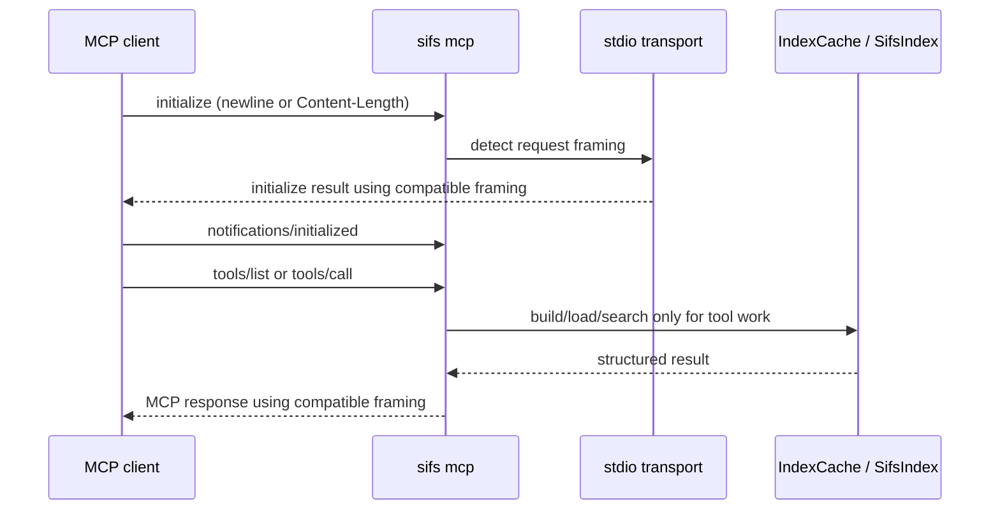

# fix: Harden MCP stdio compatibility and Codex startup

## Summary

SIFS should start reliably as an MCP server in Codex and other MCP clients by making the stdio transport compatible with both current newline-delimited MCP framing and the existing Content-Length framing path that Codex already works with. The implementation should also make MCP installation, doctor output, docs, and tests explicit enough that startup timeout failures point to an actionable cause instead of a vague client-side timeout.

---

## Problem Frame

Codex reports that the `sifs` MCP client timed out during startup, even though direct local probes of `sifs mcp` respond to `initialize` quickly. That split means the plan should not treat this as an indexing performance problem; it should harden the MCP transport, initialization lifecycle, and Codex-facing diagnostics around the actual client/server handshake.

---

## Assumptions

*This plan was authored without synchronous user confirmation. The items below are agent inferences that fill gaps in the input -- un-validated bets that should be reviewed before implementation proceeds.*

- Preserve the existing Content-Length framed MCP path because it is the behavior current SIFS tests and local Codex probes already exercise.
- Add current newline-delimited stdio framing for broader MCP compatibility instead of replacing the server with an SDK-based implementation in this pass.
- Keep `initialize` index-free and fast; move any expensive work to tool calls, cache refreshes, or explicit diagnostics.
- Treat local Codex config edits as an operator step, not a repo change, unless the user later asks to modify their `config.toml` directly.

---

## Requirements

- R1. MCP startup must complete deterministically without building, loading, or refreshing an index during `initialize`.
- R2. The stdio MCP transport must accept newline-delimited JSON-RPC messages used by current MCP SDK transports.
- R3. The stdio MCP transport must continue accepting Content-Length framed JSON-RPC messages for existing Codex/RMCP compatibility.
- R4. MCP responses must use a framing mode compatible with the request stream so clients do not hang waiting for a different transport shape.
- R5. Initialization must follow the MCP lifecycle: `initialize`, server capabilities response, optional `notifications/initialized`, operation, and graceful shutdown on stdin close.
- R6. Protocol version handling must be deliberate and tested rather than accidentally hard-coded beyond the server's declared support.
- R7. SIFS must keep stdout reserved for MCP protocol messages and route diagnostics to stderr or structured doctor output.
- R8. `sifs mcp doctor` must include a real stdio handshake smoke test so startup failures can be distinguished from search/index/cache failures.
- R9. `sifs mcp install` and MCP docs must guide Codex users toward explicit timeout settings and stable command paths.
- R10. Test coverage must include handshake, framing, startup speed, shutdown, install config, and doctor diagnostics.

---

## Scope Boundaries

- Do not redesign search ranking, indexing, chunking, embedding, or cache invalidation as part of this MCP startup fix.
- Do not require the daemon for MCP startup. Daemon-backed search can remain an optimization or separate architecture path.
- Do not add Streamable HTTP MCP transport in this fix.
- Do not remove support for Content-Length framed messages until client compatibility is proven across Codex and other local MCP clients.
- Do not make `sifs mcp doctor` depend on network access, model downloads, or a warm semantic index.
- Do not tag or prepare a release as part of this plan; update changelog entries under `Unreleased` only.

### Deferred to Follow-Up Work

- Add Streamable HTTP MCP transport if a future SIFS use case needs remote or long-lived HTTP sessions.
- Consider using an official MCP SDK if the Rust ecosystem has a stable implementation that reduces maintenance cost without constraining SIFS's CLI-first packaging.
- Add richer machine-readable doctor output such as `sifs mcp doctor --json` after the human-readable smoke checks are stable.
- Revisit generated timeout defaults after dual-framing compatibility and doctor smoke tests land; startup should normally be far below any configured timeout.

---

## Context & Research

### Local Findings

- `src/mcp.rs` owns the MCP stdio server. `serve_with_options` creates an `IndexCache`, reads requests, skips no-id notifications, responds to `initialize`, and dispatches tool/resource requests.
- `src/mcp.rs` currently emits Content-Length framed responses and `read_message` only recognizes `Content-Length:` headers before a blank line.
- `src/mcp.rs` already keeps initialization light: `initialize` returns capabilities, server info, and instructions without building the index.
- `src/main.rs` owns `sifs mcp install`, `sifs mcp doctor`, and the Codex TOML fallback. The generated fallback already includes explicit startup and tool timeout settings.
- `docs/mcp.md` documents the current MCP surface as JSON-RPC over Content-Length framing, so docs will need to change if the server accepts newline-delimited stdio too.
- `tests/cli.rs` already covers MCP install dry-run output and other CLI behaviors, while `src/mcp.rs` unit tests cover tool schemas, default source instructions, resource reads, and basic tool error behavior.
- Direct local `initialize` probes returned quickly, and `sifs mcp doctor` reported BM25 smoke as passed. That supports a compatibility/diagnostics plan rather than a cold-start indexing plan.

### External References

- The MCP lifecycle specification says initialization is the first interaction: the client sends `initialize`, the server responds with protocol version, capabilities, and server info, then the client sends `notifications/initialized` before normal operation: [MCP lifecycle](https://modelcontextprotocol.io/specification/2025-11-25/basic/lifecycle).
- The MCP stdio transport specification says a client launches the server subprocess, the server reads JSON-RPC messages from stdin and writes messages to stdout, messages are newline-delimited JSON-RPC, and stdout must not contain anything other than valid MCP messages: [MCP transports](https://modelcontextprotocol.io/specification/draft/basic/transports).
- The official TypeScript MCP SDK stdio transport serializes messages as `JSON.stringify(message) + "\n"`, matching newline-delimited framing in the transport spec: [TypeScript SDK stdio transport](https://github.com/modelcontextprotocol/typescript-sdk/blob/main/src/shared/stdio.ts).
- Codex supports MCP server configuration in `config.toml`, including `command`, `args`, `cwd`, `enabled`, `env`, tool filters, and startup timeout settings. The documented `startup_timeout_sec` default is lower than the timeout in the observed local error, so explicit configuration is preferable for local tools: [Codex config reference](https://developers.openai.com/codex/config-reference).

---

## Key Technical Decisions

| Decision | Rationale |
|----------|-----------|
| Support dual stdio framing during the compatibility period | Current SIFS/Codex behavior already works with Content-Length in direct probes, while current MCP docs and SDKs use newline-delimited JSON-RPC. Dual support avoids trading one client class for another. |
| Respond using the request's framing mode | A client that sends newline-delimited requests is likely waiting for newline-delimited responses, while a Content-Length client may be waiting for framed headers. Mirroring the request keeps the transport predictable. |
| Keep initialization index-free | The observed direct handshake is already fast, and building indexes during startup would make client timeouts more likely and harder to diagnose. |
| Add protocol smoke tests outside unit-only request handlers | Startup bugs often live in stdin/stdout framing, buffering, and process shutdown, which pure handler tests do not exercise. |
| Expand doctor before changing generated timeouts aggressively | A larger timeout hides symptoms; a doctor handshake check explains whether the failure is transport, config, binary path, permissions, or search/index behavior. |
| Preserve docs as a client contract | MCP client setup is mostly configuration. Docs must describe supported framing, restart expectations, timeout fields, and diagnostics accurately. |

---

## High-Level Technical Design

> *This illustrates the intended approach and is directional guidance for review, not implementation specification. The implementing agent should treat it as context, not code to reproduce.*

Framing behavior should be a small transport concern, not a search or tool-dispatch concern. Handler code should receive parsed JSON-RPC values and return JSON-RPC values; the stdio boundary should own detecting request framing, rejecting malformed frames, writing compatible responses, and exiting cleanly when stdin closes.

---

## Implementation Units

- U1. **Dual-mode stdio framing**

  **Goal:** Make `sifs mcp` accept both newline-delimited JSON-RPC messages and Content-Length framed JSON-RPC messages.

  **Requirements:** R2, R3, R4, R7.

  **Dependencies:** None.

  **Files:** `src/mcp.rs`; `tests/mcp_stdio.rs` or `tests/cli.rs`.

  **Approach:** Introduce a small framing layer at the stdin/stdout boundary. It should detect whether the next request is a Content-Length frame or a newline-delimited JSON-RPC message, parse exactly one message, and carry enough metadata forward for response writing. Keep tool dispatch and JSON-RPC method handling independent of framing.

  **Execution note:** Add characterization tests for the existing Content-Length path before broadening the parser.

  **Patterns to follow:** Keep the public MCP tool response shapes from existing `src/mcp.rs` tests. Follow the existing `ChildGuard` process-test style in `tests/cli.rs` if the new coverage lives there.

  **Test scenarios:**
  - Content-Length `initialize` request returns a valid Content-Length framed `initialize` response.
  - Newline-delimited `initialize` request returns a valid newline-delimited JSON-RPC `initialize` response.
  - A no-id `notifications/initialized` message is accepted and does not produce a response.
  - A newline-delimited `tools/list` request after initialization returns valid tool metadata.
  - A malformed Content-Length header produces a protocol error or clean process failure without writing non-protocol text to stdout.
  - Mixed request streams either respond per request framing or fail explicitly; they must not hang.

  **Verification:** An implementer can prove the unit complete by running process-level stdio tests that parse actual child-process stdout, not only in-process handler tests.

- U2. **Initialization and protocol-version contract**

  **Goal:** Make the MCP initialization behavior explicit, fast, and version-aware.

  **Requirements:** R1, R5, R6.

  **Dependencies:** U1.

  **Files:** `src/mcp.rs`; `tests/mcp_stdio.rs` or `tests/cli.rs`; existing `src/mcp.rs` tests.

  **Approach:** Define the set of protocol versions SIFS intentionally supports and respond consistently during `initialize`. Keep capabilities, server info, and instructions stable, and ensure no index build, cache refresh, semantic model load, or Git source operation is part of initialization.

  **Patterns to follow:** Existing `initialize` response shape in `src/mcp.rs`; existing tests that assert instructions include the default source and schemas expose expected tools.

  **Test scenarios:**
  - A supported protocol version in `initialize` receives that same version in the response.
  - An unsupported future version receives the server's chosen supported version rather than an accidental or empty value.
  - Initialization response includes `tools` and `resources` capabilities, `serverInfo`, and instructions.
  - Initialization completes for a temporary source directory with no pre-existing index cache.
  - Closing stdin after initialization causes the process to exit cleanly.

  **Verification:** Initialization tests should complete quickly and should not require a warm cache, daemon, network, or embedding model download.

- U3. **MCP doctor handshake diagnostics**

  **Goal:** Extend `sifs mcp doctor` so it tests the same stdio handshake that clients depend on.

  **Requirements:** R1, R5, R8, R10.

  **Dependencies:** U1, U2.

  **Files:** `src/main.rs`; `tests/cli.rs`; `docs/mcp.md`.

  **Approach:** Add a bounded local smoke probe to doctor that launches the resolved `sifs mcp` command against the selected source, sends `initialize`, optionally sends `notifications/initialized`, and reports handshake status and latency separately from BM25/search smoke. Exercise both supported framing modes if feasible without making doctor noisy.

  **Patterns to follow:** Existing `mcp doctor` output in `src/main.rs`; existing dry-run and doctor-style assertions in `tests/cli.rs`.

  **Test scenarios:**
  - Doctor reports the resolved executable path, source, MCP command, handshake pass/fail, and BM25 smoke as distinct lines.
  - Doctor succeeds for a temporary source with no prebuilt index.
  - Doctor reports a clear failure when the source path is invalid.
  - Doctor's handshake probe has a bounded timeout so it cannot hang indefinitely.
  - Doctor does not print probe protocol frames to stdout as part of the human-readable report.

  **Verification:** A failing handshake should produce enough information for an operator to distinguish wrong binary path, invalid source, unsupported framing, timeout, and search/index failure.

- U4. **Codex install and timeout guidance**

  **Goal:** Make generated config and docs reduce Codex startup ambiguity.

  **Requirements:** R8, R9, R10.

  **Dependencies:** U3.

  **Files:** `src/main.rs`; `tests/cli.rs`; `docs/mcp.md`.

  **Approach:** Preserve explicit `startup_timeout_sec` and `tool_timeout_sec` in generated Codex TOML. Update docs to explain when to increase startup timeout, how to rerun `sifs mcp install` or inspect `codex mcp get sifs`, and how to use doctor before assuming indexing is slow. If implementation finds the generated startup timeout is too low for real client lifecycle behavior, adjust the generated value with a test that locks the new contract.

  **Patterns to follow:** Existing `codex_toml` generation and `mcp_install_dry_run_prints_codex_command_and_config` coverage in `tests/cli.rs`.

  **Test scenarios:**
  - Codex dry-run config includes command, args, `startup_timeout_sec`, and `tool_timeout_sec`.
  - Codex dry-run config preserves stable binary path behavior.
  - Documentation describes the startup timeout warning and points to doctor and reinstall checks.
  - Documentation differentiates startup timeout from tool-call timeout.

  **Verification:** The documented troubleshooting path should start with configuration and handshake checks before recommending arbitrary timeout increases.

- U5. **Protocol cleanliness and shutdown coverage**

  **Goal:** Ensure SIFS behaves as a well-formed stdio MCP server throughout startup, operation, and shutdown.

  **Requirements:** R5, R7, R10.

  **Dependencies:** U1, U2.

  **Files:** `src/mcp.rs`; `tests/mcp_stdio.rs` or `tests/cli.rs`.

  **Approach:** Add process-level tests that assert stdout contains only parseable MCP messages and that stderr is the place for diagnostic text. Exercise EOF-driven shutdown because MCP clients close stdin during normal termination.

  **Patterns to follow:** Existing child-process cleanup pattern in `tests/cli.rs`.

  **Test scenarios:**
  - Starting the MCP process does not emit banner/log text to stdout before the first response.
  - Closing stdin without sending a request exits cleanly.
  - Closing stdin after `initialize` exits cleanly.
  - Unknown methods still return structured JSON-RPC errors without corrupting the transport.
  - If diagnostic logging is added, it appears on stderr and does not break stdout parsing.

  **Verification:** Client startup should not depend on ignoring stray stdout, killing hung processes, or waiting for a timeout after stdin closes.

- U6. **Documentation and release-note alignment**

  **Goal:** Keep user-facing MCP docs and changelog aligned with the hardened behavior.

  **Requirements:** R9, R10.

  **Dependencies:** U1, U2, U3, U4, U5.

  **Files:** `docs/mcp.md`; `CHANGELOG.md`.

  **Approach:** Update the MCP docs after implementation to describe supported transports, Codex config fields, doctor diagnostics, common startup timeout causes, and the expected restart/reload behavior for MCP clients. Add concise `Unreleased` changelog bullets for user-facing compatibility and diagnostic improvements.

  **Patterns to follow:** Existing Keep a Changelog structure in `CHANGELOG.md`; existing direct CLI examples and troubleshooting style in `docs/mcp.md`.

  **Test scenarios:** Test expectation: none -- documentation and changelog changes are reviewed for accuracy against implemented behavior.

  **Verification:** The docs should let a user reproduce the fix path without reading source code or inferring which timeout field applies.

---

## System-Wide Impact

- **Codex users:** Startup timeout warnings should become rarer, and when they occur the troubleshooting path should identify whether the issue is config, binary path, source path, transport framing, or search/index work.
- **Other MCP clients:** Newline-delimited stdio support should make SIFS more compatible with clients and SDKs that follow the current MCP stdio transport spec.
- **Existing SIFS users:** Content-Length framing and current tool schemas should continue to work, so this should be a compatibility expansion rather than a breaking change.
- **Maintainers:** Process-level MCP tests will make future changes to stdout, initialization, and shutdown less likely to regress client startup.

---

## Alternative Approaches Considered

| Alternative | Why not choose it now |
|-------------|-----------------------|
| Only increase Codex `startup_timeout_sec` | Direct probes show initialization is already fast, so a timeout increase may mask transport or lifecycle incompatibility without fixing broader MCP behavior. |
| Replace the MCP server with an SDK implementation | This could reduce protocol maintenance later, but it is a larger dependency and packaging decision than needed for the immediate startup and framing hardening. |
| Switch entirely to newline-delimited framing | That aligns with current MCP transport docs but risks breaking existing Codex/RMCP compatibility that SIFS currently supports. |
| Add Streamable HTTP MCP | HTTP is useful for different deployment shapes, but the reported failure is in local stdio startup and should be fixed there first. |
| Force daemon-backed MCP startup | The daemon may help warm search, but it should not be required for the initial MCP handshake and would add another service dependency to startup. |

---

## Risk Analysis & Mitigation

| Risk | Mitigation |
|------|------------|
| Breaking existing Content-Length clients while adding newline support | Keep Content-Length characterization tests and require both framing modes to pass at process level. |
| Creating ambiguous behavior when a client mixes framing modes | Define and test per-request response framing or explicit failure behavior. |
| Accidentally printing diagnostics to stdout | Add stdout parseability tests and route human diagnostics to stderr or doctor output. |
| Hiding real startup failures behind larger timeouts | Make doctor handshake diagnostics the primary fix path and keep timeout changes conservative. |
| Protocol version drift | Declare supported versions in one place and test supported and unsupported negotiation paths. |
| Flaky process tests | Use bounded timeouts, temporary source directories, no network/model requirements, and deterministic request payloads. |

---

## Phased Delivery

1. **Transport safety first:** U1 and U2 land together or in close sequence so framing and initialization are tested as one client-visible contract.
2. **Diagnostics next:** U3 adds doctor handshake checks once the server can exercise both framing modes reliably.
3. **Client-facing polish:** U4 and U6 update generated config expectations, docs, and changelog after behavior is final.
4. **Regression hardening:** U5 broadens shutdown/stdout coverage before the work is considered complete.

---

## Success Metrics

- A newline-delimited `initialize` request to `sifs mcp` receives a parseable response without requiring Content-Length headers.
- A Content-Length framed `initialize` request continues to receive a parseable response.
- `sifs mcp doctor` reports MCP handshake status separately from search/index smoke status.
- MCP process-level tests prove startup and shutdown without a warm cache, daemon, network, or embedding model.
- `docs/mcp.md` explains Codex startup timeout troubleshooting in terms of config, handshake, and tool-call timeout boundaries.

---

## Open Questions

### Resolved During Planning

- Should this be treated as indexing performance? No. Direct `initialize` probes are fast and `initialize` does not build the index today.
- Should SIFS drop Content-Length framing to match current docs? No. Preserve it for compatibility while adding newline-delimited support.
- Should Codex timeout config still be explicit? Yes. Explicit startup and tool timeouts make local server behavior more predictable and easier to troubleshoot.
- Should daemon-backed search be required for MCP startup? No. Startup should be independent of daemon state.

### Deferred to Implementation

- Exact helper/module split for the framing layer. Start in `src/mcp.rs` unless the implementation becomes clearer as a small sibling module.
- Exact supported protocol version list. Define it while implementing U2 based on current SIFS compatibility goals and tested client behavior.
- Whether `doctor` should test both framing modes by default or show one primary mode plus an optional verbose check. Choose the least noisy output that still catches compatibility failures.
- Whether generated Codex startup timeout should stay at its current value or increase after transport fixes. Decide from implementation evidence, not from the original timeout warning alone.

---

## Documentation Plan

- Update `docs/mcp.md` to describe both accepted stdio framing modes after implementation.
- Add a Codex startup timeout troubleshooting subsection covering `startup_timeout_sec`, `tool_timeout_sec`, `sifs mcp doctor`, and stale MCP config.
- Keep examples focused on durable user actions: install, inspect config, run doctor, restart/reload the client, then retry.
- Add `CHANGELOG.md` entries under `Unreleased` for compatibility and diagnostics when the implementation lands.
