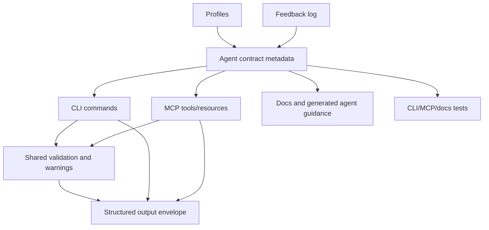

# feat: Redesign SIFS as an agent-native CLI

## Summary

Redesign SIFS' public CLI and MCP contract around agents as first-class users: self-describing command metadata, uniform structured output, strict validation, clean vocabulary, profiles, safer state changes, and local feedback. This is a coordinated breaking redesign rather than a compatibility-preserving polish pass.

---

## Problem Frame

SIFS already has strong agent-facing search primitives: bounded search, JSON for core retrieval commands, MCP schemas, MCP resources, a generated agent file, daemon reuse, and setup diagnostics. The remaining friction appears when an agent has to discover the command surface, recover from setup or filter mistakes, persist a working repo context across sessions, or reason about mutating commands. Trevin Chow's 2026 agent-native CLI principles raise the bar from "doesn't hang and can emit JSON" to "compounds through introspection, persistent identity, async/recovery affordances, and two-way I/O."

This repo is still greenfield enough that preserving confusing command shapes is not a goal. The plan should choose the clean agent-native contract now, update CLI/MCP/docs/tests together, and avoid carrying old vocabulary forward just to avoid breakage.

---

## Requirements

- R1. SIFS exposes a versioned, machine-readable `agent-context` command that describes the CLI, MCP tools, output modes, mutation boundaries, profiles, supported enums, defaults, and skill/agent guidance.
- R2. Every data-returning, diagnostic, setup, install, and mutation-adjacent command supports one canonical structured output mode using `--json`, with diagnostics on stderr and result payloads on stdout.
- R3. The canonical command vocabulary is unambiguous and conventional for agents: `source` means local path or Git URL, `filter-path` means indexed file filtering, `limit` means maximum returned records, and list/get/status verbs align across CLI and MCP.
- R4. Invalid agent input fails early with actionable, enumerable errors instead of silent fallback, especially for search modes, numeric bounds, empty sources, missing files, filter mismatches, and unsupported delivery/profile/feedback operations.
- R5. List/search outputs are bounded and self-explanatory: structured payloads indicate `limit`, `truncated`, continuation or narrowing hints where applicable, and warnings for likely agent mistakes.
- R6. State-changing operations are explicit, previewable, idempotent where practical, and machine-readable: destructive or overwriting actions require `--force`, previewable commands support `--dry-run`, and JSON responses name what changed or would change.
- R7. SIFS supports persistent profiles so agents can reuse source, ref, ranking, model, offline, and cache defaults across invocations without reconstructing long flag sets.
- R8. The MCP surface mirrors the redesigned CLI vocabulary and exposes the same core discovery, validation, profile, search, status, file-list, chunk-read, refresh, clear, init, and feedback affordances.
- R9. SIFS provides a local-first feedback channel so agents can record friction encountered during use; upstream delivery may be optional and discoverable, but local capture must work without network services.
- R10. Operations that can hang on subprocess, daemon, Git, model, or client integration boundaries have clear timeout/non-interactive behavior and structured failure reporting.
- R11. Docs, generated agent guidance, scorecard content, and changelog entries are updated in the same pass so agents and humans learn the new contract from one consistent source.

---

## Scope Boundaries

- Breaking CLI/MCP changes are allowed when they simplify the public contract or eliminate agent confusion.
- SIFS remains an agent-native code search, indexing, daemon, and integration tool; it does not become a general workflow automation platform.
- Search/ranking internals are not redesigned unless required to produce better warnings, metadata, validation, or bounded output.
- Hosted telemetry, cloud feedback collection, and remote analytics are not required; feedback starts as local JSONL plus optional endpoint support only if straightforward.
- A full schema/codegen framework is deferred. The plan may add a central contract module and tests that make future generation easier, but the implementation can remain hand-written for this pass.
- Full async job ledger support is optional and should be included only for operations that actually behave like recoverable jobs. Timeout/non-interactive recovery is required sooner than jobs.

### Deferred to Follow-Up Work

- Full command-surface generation from a single schema: defer until the redesigned contract stabilizes.
- Cursor-based pagination for every large surface: include `truncated` and narrowing hints now; add opaque cursors where the implementation proves low-risk, otherwise defer.
- Hosted feedback ingestion: keep local-first feedback in this pass.
- Broader benchmark/ranking quality work: keep this plan focused on agent-native usability and contracts.

---

## Context & Research

### Relevant Code and Patterns

- `src/main.rs` owns the Clap command tree, core command dispatch, CLI JSON/human rendering, MCP install/doctor helpers, daemon command handling, model/cache commands, and current `clean` behavior.
- `src/mcp.rs` owns MCP JSON-RPC serving, resource schemas, tool schemas, tool dispatch, structured content, default-source selection, and the current silent fallback from invalid `mode` to `hybrid`.
- `src/daemon/protocol.rs` and `src/daemon/client.rs` define daemon request/response contracts and already include a client-side timeout mechanism that can inform broader timeout behavior.
- `src/types.rs` defines `SearchMode`, `SearchOptions`, and result/stat types. `SearchMode::from_str` already has the right enum boundary, but MCP currently discards parse errors.
- `tests/cli.rs` has existing coverage for help/version, daemon ping/status, daemon install dry-run, MCP install dry-runs, MCP doctor, search JSON/JSONL, language/path filters, find-related JSON, files/status/get, and JSON/jsonl conflicts.
- `tests/mcp_stdio.rs` has MCP transport coverage for newline and Content-Length framing, initialize/tools list, unsupported protocol fallback, empty stdin, unknown method, and empty repo rejection.
- `docs/cli.md`, `docs/mcp.md`, `docs/agent-native-scorecard.md`, and `src/agents/sifs-search.md` are the main docs/guidance surfaces that must move with the public contract.
- `CHANGELOG.md` is required by `AGENTS.md` for user-facing docs, CLI, behavior, packaging, workflow, and compatibility changes.

### Institutional Learnings

- Prior SIFS work established that `sifs` is its own git repo under this checkout, not the parent aggregate directory.
- Prior install verification found `sifs mcp doctor <repo> --offline --no-cache` is a strong smoke test for installed CLI/MCP readiness, covering both stdio framing variants and BM25 smoke.
- Recent MCP hardening deliberately separated startup handshake diagnostics from search/index smoke. Preserve that separation while adding JSON output.

### External References

- Trevin Chow, "10 Principles for Agent-Native CLIs" (2026-05-01): emphasizes non-interactive defaults, universal `--json`, actionable enumerable errors, explicit mutation boundaries, bounded output, cross-CLI vocabulary, `agent-context`, async-aware recovery, profiles, and two-way I/O.
- Trevin's article references Cloudflare's schema-driven Wrangler/API/MCP approach as a model for consistent vocabulary and structured introspection. This plan adopts the consistency goal without requiring a full generation architecture in this pass.

---

## Key Technical Decisions

- Prefer a clean breaking contract over compatibility aliases: greenfield status means old ambiguous names should not remain canonical when they make agents slower or wrong.
- Centralize command metadata before adding `agent-context`: even if full codegen is deferred, the implementation needs a single source that describes commands, flags, enums, defaults, output modes, mutation boundaries, examples, and MCP equivalents well enough to test for drift.
- Use `--json` as the only structured-output flag for command-level payloads: keep JSONL only where streaming records are genuinely useful, such as search result rows, and document that distinction explicitly.
- Replace positional source-first ambiguity with explicit source vocabulary: canonical search shape should make source selection and file filtering impossible to confuse.
- Make validation shared between CLI and MCP where possible: enum parsing, numeric bounds, source validation, and filter diagnostics should not diverge between transports.
- Treat profiles as a durable agent identity for search context, not as a broad credentials/config system: profiles store source/search/cache/model defaults and are exposed through `agent-context`.
- Start feedback local-first: local recording gives agents somewhere to put friction immediately without adding hosted infrastructure or privacy obligations.
- Defer full jobs unless implementation research proves a natural job boundary: daemon operations, model pulls, and indexing need timeout and recovery semantics now, but not every long-running command needs a durable ledger in this pass.

---

## Open Questions

### Resolved During Planning

- Should backward compatibility constrain naming changes? No. The user explicitly prefers a strong greenfield redesign over preserving confusing old shapes.
- Should profiles be in scope? Yes. They are a central Tier 2 compounding feature and map naturally to SIFS' repeated repo/source/model/cache use.
- Should full async jobs be mandatory? No. Timeout and non-interactive behavior are mandatory; durable jobs are included only if implementation reveals a clear recoverable operation set.
- Should the search engine itself be redesigned? No. This plan targets agent-native usability and public contracts, not ranking quality.

### Deferred to Implementation

- Exact storage location and file format for profiles/feedback: decide while implementing against platform-cache conventions and privacy constraints, then document it in `agent-context`.
- Whether `files` pagination gets a real cursor in this pass: implement `truncated`/hint first; add cursor only if the index/file list representation supports it cleanly.
- Whether model pulls warrant a durable job ledger: evaluate during model command redesign; if a simple `--wait`/timeout JSON result is enough, avoid a premature jobs subsystem.
- Whether command metadata can be generated from Clap in this pass: prefer shared metadata if straightforward, but do not block the redesign on perfect generation.

---

## High-Level Technical Design

> *This illustrates the intended approach and is directional guidance for review, not implementation specification. The implementing agent should treat it as context, not code to reproduce.*

The redesigned contract should make command discovery, invocation, validation, output interpretation, and recovery feel consistent whether the caller uses the CLI, MCP, or generated agent guidance.

---

## Phased Delivery

### Phase 1: Contract and validation spine

- Establish the shared command metadata and validation model.
- Add `agent-context`.
- Normalize canonical vocabulary and structured output envelopes.
- Fix silent MCP validation failures.

### Phase 2: Setup, diagnostics, and mutation safety

- Make doctor/install/daemon/model/cache/init/clean JSON-capable.
- Add `--no-input`, subprocess stdin closure where needed, and timeout behavior.
- Tighten `--dry-run`/`--force` semantics.

### Phase 3: Compounding primitives

- Add profiles and profile-aware command resolution.
- Add local feedback.
- Add optional delivery/output sinks only where they materially improve result handoff.

### Phase 4: MCP, docs, and release polish

- Mirror the new contract in MCP tools/resources.
- Update docs, generated agent guidance, scorecard, tests, and changelog.
- Remove old vocabulary from examples and expected outputs.

---

## Implementation Units

- U1. **Define the agent-native contract metadata**

**Goal:** Create a repo-local representation of the public agent contract that can power `agent-context`, docs/tests, and CLI/MCP parity checks without requiring full codegen.

**Requirements:** R1, R3, R8, R11

**Dependencies:** None

**Files:**
- Create or modify: `src/agent_context.rs` or an equivalent module chosen during implementation
- Modify: `src/lib.rs`
- Modify: `src/main.rs`
- Modify: `src/mcp.rs`
- Test: `tests/cli.rs`
- Test: `tests/mcp_stdio.rs`

**Approach:**
- Introduce a structured contract model for commands, flags, arguments, enum values, defaults, output modes, mutation boundaries, profile support, and MCP tool equivalents.
- Include a `schema_version` and package version so agents can detect shape changes.
- Use the model to produce `sifs agent-context --json` and an MCP-visible context resource/tool.
- Keep the first version pragmatic: hand-authored metadata is acceptable if tests assert it matches the real command surface for critical names and modes.

**Patterns to follow:**
- Existing `tool_schemas()` and `resource_schemas()` in `src/mcp.rs` show the current hand-authored schema style.
- Existing Clap command definitions in `src/main.rs` remain the authoritative executable parser until generation is introduced.

**Test scenarios:**
- Happy path: invoking `sifs agent-context --json` returns valid JSON with `schema_version`, CLI version, commands, flags, enum values, MCP tools, output modes, mutation boundaries, and profile support.
- Happy path: `agent-context` lists canonical commands and does not list removed ambiguous vocabulary as canonical.
- Edge case: `agent-context` runs without indexing a source, touching model files, or requiring network access.
- Integration: MCP exposes equivalent agent-context data through a tool or resource, and the payload agrees with the CLI command for command names and enum values.
- Error path: requesting a non-JSON form for `agent-context`, if unsupported, fails with a clear message rather than emitting partial human prose.

**Verification:**
- Agents can discover the redesigned command and MCP shape from `agent-context` without scraping help text.

- U2. **Redesign canonical CLI vocabulary and command shapes**

**Goal:** Replace ambiguous greenfield command shapes with a clean agent-native vocabulary.

**Requirements:** R3, R4, R11

**Dependencies:** U1

**Files:**
- Modify: `src/main.rs`
- Modify: `docs/cli.md`
- Modify: `src/agents/sifs-search.md`
- Test: `tests/cli.rs`

**Approach:**
- Make `source` the canonical name for local paths and Git URLs across search, related lookup, file listing, status, get, MCP install, MCP server mode, and doctor flows.
- Make `filter-path` the canonical search filter name.
- Make `limit` the canonical result count name; use internal `top_k` only as a ranking implementation detail if still useful.
- Prefer conventional verbs: `list-files` or a clear subcommand grouping over bare `files` if the final command tree reads better for agents.
- Remove or intentionally break confusing old shapes instead of preserving aliases solely for compatibility.

**Patterns to follow:**
- Existing Clap `ValueEnum` usage for modes and clients.
- Existing `docs/cli.md` command sections, rewritten around the new contract.

**Test scenarios:**
- Happy path: canonical search invocation with explicit `--source`, `--filter-path`, `--limit`, and `--json` returns structured results.
- Happy path: canonical file listing and chunk retrieval commands use the same source vocabulary as search.
- Error path: old ambiguous `--path` filter usage is rejected or absent from help, with a helpful replacement message if feasible.
- Error path: positional source ambiguity is removed from help/examples, and invalid invocation fails before indexing.
- Integration: `--help`, docs, generated agent guidance, and `agent-context` agree on canonical names.

**Verification:**
- A new agent reading only top-level help plus `agent-context` can infer the same command vocabulary used in docs and tests.

- U3. **Unify structured output and result envelopes**

**Goal:** Make structured output predictable across core search, diagnostics, setup, install, daemon, model, cache, init, clean, profile, and feedback commands.

**Requirements:** R2, R5, R6, R10

**Dependencies:** U1, U2

**Files:**
- Modify: `src/main.rs`
- Modify: `src/daemon/protocol.rs`
- Modify: `docs/cli.md`
- Test: `tests/cli.rs`

**Approach:**
- Add `--json` to currently human-only commands such as `doctor`, `mcp doctor`, `mcp install --dry-run`, `daemon ping`, `daemon install-agent --dry-run`, `daemon uninstall-agent --dry-run`, `capabilities`, `init`, `clean`, `cache clean`, and `model pull`.
- Standardize structured payload conventions: status fields, source identity, elapsed time when meaningful, warnings, changed/would-change fields, next actions, and truncation metadata.
- Keep stdout reserved for machine-readable result payloads in JSON mode; send warnings/diagnostics that are not part of the payload to stderr.
- Preserve JSONL only for row-streaming commands where one-record-per-line is useful.

**Patterns to follow:**
- `print_search_output`, `print_find_related_output`, `print_files_output`, `print_status_output`, and `print_get_output` show existing JSON rendering.
- `run_mcp_doctor`, `install_launch_agent`, and installer dry-runs show the human-only surfaces that need structured equivalents.

**Test scenarios:**
- Happy path: every command listed in R2 accepts `--json` and emits parseable JSON on stdout.
- Happy path: dry-run install commands return structured command arrays and fallback config objects rather than only shell-rendered strings.
- Happy path: mutation commands in JSON mode report `changed` or `would_change` and the target path/config.
- Error path: failed JSON-mode commands keep stdout empty or valid partial-free JSON according to the chosen convention, and place human diagnostic text on stderr.
- Integration: existing core search JSON remains parseable after envelope changes and includes bounded-output metadata.

**Verification:**
- The CLI has one consistent structured-output story that an agent can apply to setup, diagnosis, search, and cleanup without command-specific scraping.

- U4. **Implement shared validation and agent-teaching warnings**

**Goal:** Replace silent fallback and vague empty-result behavior with early validation, structured errors, and actionable warnings.

**Requirements:** R4, R5, R8, R10

**Dependencies:** U2, U3

**Files:**
- Modify: `src/main.rs`
- Modify: `src/mcp.rs`
- Modify: `src/types.rs`
- Modify: `src/search.rs` if search-result warning generation needs index context
- Test: `tests/cli.rs`
- Test: `tests/mcp_stdio.rs`
- Test: `tests/core.rs`

**Approach:**
- Share parsing/validation helpers between CLI and MCP for search mode, limit bounds, alpha bounds, source emptiness, line bounds, profile names, feedback delivery schemes, and timeout values.
- Make MCP invalid `mode` fail with an enumerable error instead of defaulting to `hybrid`.
- Add filter-aware warnings when language or filter-path inputs match no indexed languages/files.
- Add path suggestion behavior for common repository-relative path mistakes when feasible.
- Ensure validation happens before network/model/index side effects wherever possible.

**Patterns to follow:**
- `SearchMode::from_str` in `src/types.rs` already defines the mode enum boundary.
- Existing MCP empty repo rejection in `selected_source` demonstrates the desired fail-fast direction.

**Test scenarios:**
- Error path: MCP `search` with `mode: "lexical"` returns `isError: true` and enumerates valid modes.
- Error path: CLI search with invalid mode/limit/alpha/source fails before indexing and names valid values or bounds.
- Edge case: `--filter-path ./src/lib.rs` against indexed `src/lib.rs` returns a warning or suggestion rather than a silent empty result.
- Edge case: unknown language filter reports valid indexed languages when the index is available.
- Integration: CLI and MCP invalid inputs produce equivalent machine-readable error categories.

**Verification:**
- Agents can self-correct common invocation mistakes from the first error or warning payload.

- U5. **Harden bounded output and truncation semantics**

**Goal:** Make every potentially partial output explicitly bounded and teach agents how to narrow or continue.

**Requirements:** R5, R8

**Dependencies:** U3, U4

**Files:**
- Modify: `src/main.rs`
- Modify: `src/mcp.rs`
- Modify: `src/daemon/protocol.rs` if daemon list/search payloads need new metadata
- Modify: `docs/cli.md`
- Modify: `docs/mcp.md`
- Test: `tests/cli.rs`
- Test: `tests/mcp_stdio.rs`

**Approach:**
- Add `truncated` and `hint` or `next_action` fields to list/search payloads where `total > limit` or content/context is omitted.
- Add hard maximums for context lines or content bytes if current commands can produce pathological output.
- Keep default limits narrow and documented.
- Add cursor support only where low-risk; otherwise document the narrowing path and defer cursors.

**Patterns to follow:**
- Current `files` output already includes `total` and `limit`, making it the easiest surface to extend.
- Current search output already has `top_k`, warnings, and structured results.

**Test scenarios:**
- Happy path: file listing with fewer files than `limit` returns `truncated: false`.
- Edge case: file listing with more files than `limit` returns `truncated: true` and a narrowing/continuation hint.
- Edge case: search with a small limit reports the requested limit consistently across CLI, daemon-backed CLI, and MCP.
- Error path: excessive context/content requests are capped or rejected with a structured explanation.

**Verification:**
- Agents can tell whether they saw the complete result set and what to do next when they did not.

- U6. **Normalize mutation boundaries and non-interactive execution**

**Goal:** Make state-changing operations previewable, explicit, idempotent where possible, and safe for unattended agent execution.

**Requirements:** R6, R10

**Dependencies:** U3, U4

**Files:**
- Modify: `src/main.rs`
- Modify: `src/daemon/client.rs` if timeout configuration is surfaced globally
- Modify: `docs/cli.md`
- Test: `tests/cli.rs`

**Approach:**
- Add a global `--no-input` contract and enforce no prompting by closing/nulling stdin for external subprocesses where appropriate.
- Add global or command-specific `--timeout` support for daemon, MCP probe, Git/model/subprocess boundaries where timeouts matter.
- Replace `sifs clean` with an explicit cache-cleaning contract or require `--dry-run`/`--force`/`--json`.
- Ensure `init`, install, uninstall, cache clean, profile delete, and feedback send behavior follows the same `--dry-run`/`--force` vocabulary.
- Return structured next actions when external CLIs are missing, stale, or fail.

**Patterns to follow:**
- `install_launch_agent` and `run_mcp_probe` already include some safety checks and timeout behavior.
- `cache clean --dry-run` already previews a destructive cache operation.

**Test scenarios:**
- Happy path: `--dry-run --json` for install/clean operations reports intended changes without modifying files.
- Error path: destructive operations without required `--force` fail with a structured next action.
- Error path: external CLI subprocess failure includes program, args, exit status, stderr summary, and next action in JSON mode.
- Edge case: `--no-input` causes subprocesses to run with closed/null stdin and never wait for terminal input.
- Integration: timeout errors are surfaced consistently for daemon and MCP probe paths.

**Verification:**
- Re-running agent commands cannot silently duplicate or destroy state without explicit preview/force contracts.

- U7. **Add persistent profiles**

**Goal:** Let agents save and reuse named SIFS contexts across invocations.

**Requirements:** R1, R7, R8

**Dependencies:** U1, U2, U3, U4

**Files:**
- Create or modify: `src/profiles.rs`
- Modify: `src/lib.rs`
- Modify: `src/main.rs`
- Modify: `src/mcp.rs`
- Modify: `docs/cli.md`
- Modify: `docs/mcp.md`
- Test: `tests/cli.rs`
- Test: `tests/mcp_stdio.rs`

**Approach:**
- Add `profile save`, `profile list`, `profile show`, and `profile delete` commands with JSON support.
- Add `--profile` to source/search/status/list/get/MCP setup flows where profile defaults are useful.
- Store source, ref, mode, limit, encoder/model, offline/no-download, and cache policy defaults. Avoid storing secrets.
- Define precedence: explicit flag > environment variable > profile > default.
- Surface profile names and profile-supported commands in `agent-context` and MCP.

**Patterns to follow:**
- Existing platform cache conventions in `CacheConfig` and cache summary helpers should guide durable storage location.
- Existing source resolution through `SourceSpec::resolve` should remain the validation boundary.

**Test scenarios:**
- Happy path: saving a profile with a local source and bm25 mode allows a later search with `--profile` and no explicit source.
- Happy path: explicit flags override profile values and the JSON payload reports the active profile.
- Happy path: `profile list --json` and `agent-context --json` expose the saved profile.
- Error path: deleting a profile requires `--force` or a similarly explicit mutation boundary.
- Error path: missing profile names fail before indexing and include available profile names.
- Integration: MCP search can use a profile or discover profiles through agent-context/profile tools.

**Verification:**
- Agents can persist a working repo/search context and rediscover it later without parsing config files.

- U8. **Add local-first feedback and optional delivery/output sinks**

**Goal:** Give agents a structured place to report friction and, where useful, route command artifacts without ad hoc shell glue.

**Requirements:** R1, R9, R10

**Dependencies:** U1, U3, U4, U6

**Files:**
- Create or modify: `src/feedback.rs`
- Modify: `src/lib.rs`
- Modify: `src/main.rs`
- Modify: `src/mcp.rs`
- Modify: `docs/cli.md`
- Modify: `docs/mcp.md`
- Test: `tests/cli.rs`
- Test: `tests/mcp_stdio.rs`

**Approach:**
- Add `feedback create`, `feedback list`, and optionally `feedback send`.
- Store feedback locally as append-only structured records with timestamp, CLI version, optional command context, message, and send status.
- Add optional upstream endpoint support only if it is simple, explicit, and discoverable.
- Consider `--output` or `--deliver file:<path>` only for commands where routing structured artifacts materially reduces agent steps; do not force delivery sinks onto every command.
- Expose feedback support and configured upstream availability through `agent-context`.

**Patterns to follow:**
- Existing JSONL search mode can inform local append-only record handling.
- Existing shell-quoted command display in install dry-runs can inform recording command context without leaking excessive data.

**Test scenarios:**
- Happy path: creating feedback records one local entry and returns its id/path in JSON mode.
- Happy path: listing feedback returns bounded structured records with `limit` and `truncated`.
- Error path: empty feedback text is rejected with a structured message.
- Error path: unsupported delivery or send scheme enumerates supported schemes.
- Integration: MCP exposes feedback creation/listing or equivalent resource discovery.

**Verification:**
- Agents can record tool friction in a durable local channel that maintainers can inspect later.

- U9. **Mirror the redesigned contract in MCP**

**Goal:** Make MCP a first-class peer of the CLI rather than a partially richer or differently named surface.

**Requirements:** R1, R2, R3, R4, R5, R7, R8, R9

**Dependencies:** U1, U2, U3, U4, U5, U7, U8

**Files:**
- Modify: `src/mcp.rs`
- Modify: `src/agents/mcp-instructions.md`
- Modify: `src/agents/tools/search.md`
- Modify: `src/agents/tools/find-related.md`
- Modify: `src/agents/tools/index-status.md`
- Modify: `src/agents/messages/no-results.md`
- Modify: `src/agents/messages/no-repo.md`
- Modify: `docs/mcp.md`
- Test: `tests/mcp_stdio.rs`

**Approach:**
- Rename or add MCP tools to align with canonical CLI vocabulary, with old names removed if they are inconsistent with the new greenfield contract.
- Include `agent_context`, profile tools, feedback tools, and canonical list/get/status/search tool names.
- Ensure tool descriptions remain compact; detailed workflow guidance belongs in instructions/resources/agent files.
- Use shared validation and structured warnings from U4 instead of MCP-specific fallback behavior.
- Keep MCP startup lightweight: no indexing/model loading during initialize.

**Patterns to follow:**
- Current MCP transport compatibility and initialization tests should remain intact.
- Current `structuredContent` pattern is the right direction and should be broadened, not replaced by text-only returns.

**Test scenarios:**
- Happy path: `tools/list` exposes canonical tool names and compact descriptions.
- Happy path: `agent_context` MCP call/resource matches CLI `agent-context` for command/tool vocabulary.
- Error path: invalid search mode, invalid limit, missing profile, and empty repo all return `isError: true` with structured content or clear text.
- Edge case: MCP initialize still avoids index/model work after adding new resources/tools.
- Integration: MCP profile-backed search uses the same defaults and override precedence as CLI profile-backed search.

**Verification:**
- An MCP client can discover, validate, search, inspect, profile, and report feedback without depending on CLI prose docs.

- U10. **Refresh docs, generated agent guidance, scorecard, and changelog**

**Goal:** Make all human and agent-facing documentation match the redesigned contract.

**Requirements:** R11

**Dependencies:** U1 through U9

**Files:**
- Modify: `README.md`
- Modify: `docs/cli.md`
- Modify: `docs/mcp.md`
- Modify: `docs/agent-native-scorecard.md`
- Modify: `src/agents/sifs-search.md`
- Modify: `src/agents/mcp-instructions.md`
- Modify: `CHANGELOG.md`
- Test: `tests/cli.rs` if docs/help assertions are colocated there

**Approach:**
- Rewrite examples around canonical `source`, `filter-path`, `limit`, `agent-context`, profiles, feedback, and JSON diagnostics.
- Update the scorecard from the older agent-native assessment to Trevin's 10-principle framing or add a companion scorecard section that distinguishes Tier 1 and Tier 2.
- Document breaking changes plainly because compatibility is not a goal for this redesign.
- Keep generated agent instructions concise and workflow-focused.

**Patterns to follow:**
- Existing docs are split by CLI, MCP, architecture, library, benchmarks, and scorecard; preserve that structure rather than creating one giant guide.
- `AGENTS.md` changelog discipline requires user-facing docs/workflow changes under `Unreleased`.

**Test scenarios:**
- Happy path: command examples in generated agent guidance use canonical commands and flags.
- Happy path: docs mention `agent-context`, profiles, feedback, JSON diagnostics, strict validation, and mutation boundaries.
- Error path: no docs/examples continue recommending removed ambiguous flags.
- Verification-only: changelog includes user-facing breaking changes and agent-native additions under `Unreleased`.

**Verification:**
- A human or agent reading docs after implementation sees one coherent contract, not old and new surfaces mixed together.

- U11. **Add contract-level regression tests**

**Goal:** Prevent the redesigned agent-native surface from drifting as SIFS evolves.

**Requirements:** R1 through R11

**Dependencies:** U1 through U10

**Files:**
- Modify: `tests/cli.rs`
- Modify: `tests/mcp_stdio.rs`
- Modify: `tests/core.rs`
- Create: additional integration test files under `tests/` if the existing files become too large

**Approach:**
- Add tests that assert `agent-context`, Clap help, docs-critical examples, and MCP tool schemas stay aligned for canonical command names and enum values.
- Add structured-output smoke tests for every JSON-capable command.
- Add negative tests for removed ambiguous vocabulary and invalid MCP arguments.
- Add profile and feedback lifecycle integration tests.
- Keep tests fixture-based and offline where possible.

**Patterns to follow:**
- Existing tempdir fixtures in `tests/cli.rs` and `tests/mcp_stdio.rs`.
- Existing daemon socket tempdir pattern for daemon-backed tests.

**Test scenarios:**
- Happy path: complete agent-native smoke flow creates a profile, searches with it, lists files, gets a chunk, records feedback, and reads agent-context.
- Happy path: MCP smoke flow initializes, lists canonical tools, reads agent context, and performs profile-backed or explicit-source search.
- Error path: invalid enum, missing source/profile, destructive command without force, unsupported feedback/delivery scheme, and timeout boundary all produce structured failures.
- Integration: every command documented as JSON-capable is exercised in JSON mode at least once.

**Verification:**
- Future command-surface drift is caught by automated tests rather than manual review.

---

## System-Wide Impact

- **Interaction graph:** CLI, MCP, daemon IPC, profile storage, feedback storage, generated agent guidance, docs, and tests all share the redesigned public vocabulary.
- **Error propagation:** validation failures should be caught before indexing/model/network side effects; daemon and MCP errors should preserve structured categories where possible.
- **State lifecycle risks:** profiles and feedback introduce durable local state. Profile deletes and feedback sends need explicit mutation boundaries, bounded listing, and privacy-aware docs.
- **API surface parity:** CLI commands, MCP tools/resources, `agent-context`, docs, and generated agent files must agree on command names, enum values, defaults, limits, and mutation semantics.
- **Integration coverage:** unit tests alone are insufficient; the plan requires CLI integration tests and MCP stdio tests because agents consume both surfaces.
- **Unchanged invariants:** search modes, indexing mechanics, daemon warm-index reuse, MCP lightweight initialize, offline/no-download semantics, and cache configuration behavior remain conceptually intact unless touched to satisfy the new public contract.

---

## Alternative Approaches Considered

- Compatibility-first aliasing: rejected because the user explicitly wants the clean greenfield contract and old aliases would preserve the source/filter ambiguity.
- Full schema/codegen rewrite first: deferred because it could consume the whole pass before improving user-visible agent behavior. A central contract model and drift tests get most of the benefit now.
- MCP-only agent-native upgrade: rejected because Trevin's article is specifically about CLI-native agent usability, and SIFS should be equally strong through shell and MCP.
- Jobs-led redesign: deferred because SIFS' current core operations are mostly synchronous. Timeout and recovery behavior solve the immediate agent pain with less carrying cost.

---

## Success Metrics

- `sifs agent-context --json` gives enough structured information for an agent to invoke core CLI and MCP workflows without reading prose docs.
- Every setup/diagnostic/mutation command likely to be used during recovery has parseable JSON output.
- Invalid MCP and CLI inputs produce actionable errors with valid values or bounds.
- Profiles let an agent repeat a source-specific search workflow without restating source/model/cache/offline flags.
- Docs, generated agent guidance, MCP tool names, and CLI help no longer conflict on source/path/limit vocabulary.
- Test coverage proves at least one end-to-end agent workflow through CLI and one through MCP.

---

## Risks & Dependencies

| Risk | Likelihood | Impact | Mitigation |
|------|------------|--------|------------|
| Contract metadata drifts from Clap or MCP schemas | Medium | High | Add tests that compare canonical command names, enums, and tool names across `agent-context`, help-adjacent metadata, and MCP schemas. |
| Breaking redesign invalidates existing docs/tests/examples in subtle ways | High | Medium | Treat U10 and U11 as required, not cleanup. Remove old vocabulary from docs and update assertions in the same pass. |
| Profiles introduce confusing precedence or hidden state | Medium | High | Document and test precedence: explicit flag > env > profile > default. Include active profile and resolved source in JSON payloads. |
| Feedback records accidentally capture sensitive local data | Medium | Medium | Keep feedback text user/agent supplied, avoid automatic file content capture, document storage location, and make upstream sending explicit. |
| Universal JSON support expands implementation scope | High | Medium | Use shared output helpers/envelopes and start with structured payloads that mirror existing human diagnostics rather than over-designing schemas. |
| Removing old commands makes implementation order awkward | Medium | Medium | Land contract/docs/tests together in a coordinated branch; do not attempt piecemeal compatibility during the redesign. |
| Async jobs become a distraction | Medium | Medium | Keep jobs deferred unless a concrete model/index operation clearly needs durable submit/poll/recover semantics. |

---

## Documentation / Operational Notes

- Update `CHANGELOG.md` under `Unreleased` with breaking CLI/MCP changes, new agent-context, JSON diagnostics, profiles, feedback, validation, and docs changes.
- Update install/readiness docs so `sifs mcp doctor --json` becomes the recommended machine-readable smoke check.
- Update `docs/agent-native-scorecard.md` to reflect Trevin's 10-principle framing and identify any intentionally deferred items.
- Include a migration/breaking-change note in `README.md` or `docs/cli.md` because old examples will intentionally stop working.
- Keep all examples offline-friendly where possible to avoid agents triggering model downloads or remote Git operations during smoke tests.

---

## Sources & References

- Related code: `src/main.rs`
- Related code: `src/mcp.rs`
- Related code: `src/daemon/protocol.rs`
- Related code: `src/daemon/client.rs`
- Related code: `src/types.rs`
- Related tests: `tests/cli.rs`
- Related tests: `tests/mcp_stdio.rs`
- Related docs: `docs/cli.md`
- Related docs: `docs/mcp.md`
- Related docs: `docs/agent-native-scorecard.md`
- Related agent guidance: `src/agents/sifs-search.md`
- External reference: [10 Principles for Agent-Native CLIs](https://trevinsays.com/p/10-principles-for-agent-native-clis)
