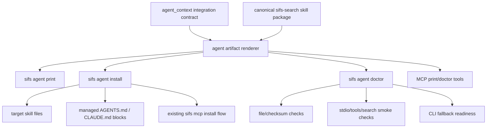

# feat: Add CLI-First Agent Skill Installer

## Summary

Build SIFS agent integration around one canonical, CLI-first `sifs-search` skill and a small target-aware installer/exporter/doctor. MCP remains useful, but it becomes an optional capability layer that generated skills can use when visible, not the primary integration path.

The implementation should ship:

- A canonical SIFS skill package that works for agents with shell access.
- Target-aware local artifacts for Codex, Claude Code, OpenClaw, Hermes, and generic agent-skill consumers.
- `sifs agent print|install|doctor|uninstall` commands with `--target`, `--artifact`, `--dry-run`, `--force`, and `--json` surfaces.
- A managed `AGENTS.md` / `CLAUDE.md` snippet inserter that teaches agents to use SIFS for codebase search.
- A readiness doctor that distinguishes installed files, stale generated content, MCP config, MCP handshake, search smoke, and current-session visibility.
- Updated `agent-context` metadata so agents can discover the supported integration contract without scraping docs.

This plan deliberately keeps public marketplace/plugin publishing out of the first implementation pass. OpenClaw and Hermes should get local skill artifacts and doctors first; public discovery should only be claimed after the runtime-specific distribution mechanisms are verified.

## Goals

1. Make the CLI the canonical execution path for agents.
2. Keep MCP as an optional convenience and compatibility surface.
3. Give agents a portable skill they can use even when MCP tools are not visible in the current session.
4. Provide deterministic, idempotent mutation commands for installing skills and managed instruction snippets.
5. Make all generated artifacts inspectable before mutation through print and dry-run JSON.
6. Detect drift between canonical generated content and installed files/snippets.
7. Preserve existing `init`, MCP install, MCP doctor, profile, feedback, and `agent-context` behavior unless deliberately superseded with compatibility shims.

## Non-Goals

- Do not remove the MCP server.
- Do not make MCP the only integration path.
- Do not claim public OpenClaw or Hermes marketplace/listing support.
- Do not add hosted telemetry or remote skill registries.
- Do not make broad context-pack/session-memory features part of this change.
- Do not expose broad filesystem mutation tools over MCP in the first pass.
- Do not rewrite the search/indexing engine as part of this work.

## Key Decisions

### CLI first, MCP optional

Generated skills should say: use MCP `search`, `get_chunk`, and `list_files` only when those tools are visible in the current agent session. Otherwise, use shell commands such as `sifs search`, `sifs list-files`, `sifs get`, and `sifs agent-context --json`.

Reasoning: configuring MCP is not the same as making MCP tools visible to the live agent. The CLI is the reliable fallback and should be the canonical behavior contract.

### One canonical skill, rendered for targets

Use one canonical `sifs-search` skill package as the source of truth, with thin target-specific renderers/mirrors for runtime conventions:

- Generic: `skills/sifs-search/`
- OpenClaw local skill mirror: `extras/openclaw/sifs-search/`
- Hermes local skill mirror: `extras/hermes/sifs-search/`
- Portable agent-skill mirror: `extras/agent-skills/sifs-search/`
- Embedded CLI templates: loaded from the canonical package or mirrored into `src/agents/` for crate packaging

This follows the proven package shape used by `clipmem`: canonical skill first, native mirrors only where runtime packaging/discovery requires them.

### `sifs agent` owns the integration surface

Add a new top-level command family:

```text
sifs agent print --target <target> --artifact <artifact>
sifs agent install --target <target> --artifact <artifact>
sifs agent doctor --target <target>
sifs agent uninstall --target <target> --artifact <artifact>
```

Valid targets:

```text
codex | claude-code | openclaw | hermes | generic | all
```

Valid artifacts:

```text
skill | snippet | mcp | all
```

`sifs init` should remain compatible, but route internally to the new artifact renderer/installer where practical.

### Managed instruction blocks, not free-form appends

Snippet insertion into `AGENTS.md` and `CLAUDE.md` must use stable managed markers:

```markdown
<!-- BEGIN SIFS AGENT INSTRUCTIONS schema=1 checksum=<sha256> -->
...
<!-- END SIFS AGENT INSTRUCTIONS -->
```

Rules:

- Preserve all content outside the managed block.
- Insert once.
- Re-running with identical content is a no-op.
- Updating stale generated content changes only the managed block.
- User-edited managed blocks are conflicts unless `--force` is passed.
- Uninstall removes only the managed block.

### Doctor reports a matrix, not one boolean

Doctor JSON should return target/artifact readiness as independent tri-state checks:

```text
pass | fail | unknown
```

Checks should include, where relevant:

- `binary_on_path`
- `binary_version_current`
- `skill_present`
- `skill_content_current`
- `snippet_present`
- `snippet_content_current`
- `mcp_config_present`
- `mcp_handshake_ok`
- `mcp_tools_listed`
- `search_smoke_ok`
- `visible_to_current_session`
- `cli_fallback_ready`

`unknown` is a real state, especially for OpenClaw/Hermes current-session visibility if no deterministic local probe exists.

## Current State

Relevant existing files:

- `src/main.rs` defines the CLI, including `init`, `agent-context`, `mcp install`, `mcp doctor`, profiles, feedback, and daemon commands.
- `src/agent_context.rs` emits machine-readable agent-facing CLI/MCP guidance.
- `src/mcp.rs` exposes MCP tools/resources, including `agent_context`, search/status/file/chunk tools, profiles, feedback, and `init_agent`.
- `src/agents/sifs-search.md` is the current embedded agent guidance, but it is Claude-shaped and not target-aware.
- `tests/cli.rs` already covers MCP install dry-runs, MCP doctor, `agent-context`, profiles, feedback, and core search behavior.
- `docs/ideation/2026-05-05-agent-native-integrations-ideation.md` captures the integration opportunity and warns against overclaiming target-native packaging before it is verified.

Existing strengths to reuse:

- `--dry-run --json` installer pattern from `sifs mcp install`.
- MCP doctor separation between protocol handshake and search smoke.
- Agent-native vocabulary already established in the greenfield redesign plan: `source`, `filter-path`, `limit`, `list-files`, JSON payloads, bounded output metadata, and narrowing hints.
- `agent-context --json` as the right machine-readable discovery surface.

## Target Support Matrix

| Target | First-pass artifacts | Default install behavior | Doctor confidence |
| --- | --- | --- | --- |
| `generic` | `skill` | Print/install portable `SKILL.md` package to explicit `--destination` | High for file/content checks |
| `codex` | `skill`, `snippet`, `mcp` | Install Codex skill when a known local skill root is available; insert `AGENTS.md` snippet when requested; reuse existing MCP config flow | High for files/config; current-session MCP visibility may be `unknown` |
| `claude-code` | `skill`, `snippet`, `mcp` | Keep `.claude/agents/sifs-search.md` compatibility; insert `CLAUDE.md` snippet when requested; reuse existing MCP config flow | High for files/config/stdio; visibility depends on available CLI probes |
| `openclaw` | `skill`, `snippet` | Generate/install local skill artifact only when a deterministic local path is configured or passed | Medium; visibility may be `unknown` |
| `hermes` | `skill`, `snippet` | Generate/install local skill artifact only when a deterministic local path is configured or passed | Medium; visibility may be `unknown` |
| `all` | Any requested artifact supported by installed targets | Best-effort per target, not transactional | Per-target result matrix |

For targets where default paths are not proven, require `--destination` or return `unknown_default_destination` with a next action. Do not silently write to guessed locations.

## Public CLI Contract

### Print

Print renders artifacts without filesystem mutation.

Examples:

```bash
sifs agent print --target codex --artifact snippet
sifs agent print --target generic --artifact skill --json
sifs agent print --target claude-code --artifact skill --destination .claude/agents/sifs-search.md --json
```

Without `--json`, stdout is the raw artifact content only. Diagnostics go to stderr.

With `--json`, stdout is structured:

```json
{
  "schema_version": 1,
  "target": "codex",
  "artifact": "snippet",
  "destination_hint": "AGENTS.md",
  "content": "...",
  "checksum": "sha256:...",
  "mcp_optional": true,
  "mcp_required": false,
  "warnings": [],
  "next_actions": [
    "Run sifs agent install --target codex --artifact snippet --file AGENTS.md"
  ]
}
```

### Install

Install writes only requested artifacts.

Examples:

```bash
sifs agent install --target codex --artifact snippet --file AGENTS.md --dry-run --json
sifs agent install --target claude-code --artifact skill --destination .claude/agents/sifs-search.md
sifs agent install --target openclaw --artifact skill --destination ~/.agents/skills/sifs-search
sifs agent install --target all --artifact all --dry-run --json
```

Install options:

- `--target <target>`
- `--artifact <artifact>`
- `--destination <path>` for skill/package destinations
- `--file <path>` for snippet insertion
- `--source <path>` only when explicitly pinning project-local guidance
- `--profile <name>` only when explicitly generating profile-aware guidance
- `--dry-run`
- `--force`
- `--json`

Install status values:

- `planned`
- `installed`
- `updated`
- `unchanged`
- `conflict`
- `unsupported`
- `unknown_default_destination`
- `failed`

For `--target all`, report one result object per target/artifact. Continue best-effort, but exit non-zero if any explicitly requested install fails.

### Doctor

Doctor inspects configured artifacts and reports readiness.

Examples:

```bash
sifs agent doctor --target codex
sifs agent doctor --target all --json
sifs agent doctor --target claude-code --artifact mcp --json
```

JSON shape:

```json
{
  "schema_version": 1,
  "targets": [
    {
      "target": "codex",
      "status": "ready_fallback_only",
      "checks": [
        {
          "name": "snippet_present",
          "state": "pass",
          "evidence": "AGENTS.md contains current SIFS managed block"
        },
        {
          "name": "mcp_config_present",
          "state": "pass",
          "evidence": "Codex config contains sifs MCP server"
        },
        {
          "name": "visible_to_current_session",
          "state": "unknown",
          "evidence": "No deterministic probe is available from this process"
        }
      ],
      "next_actions": [
        "Use CLI fallback: sifs search --source <project> <query>"
      ]
    }
  ]
}
```

### Uninstall

Uninstall removes only SIFS-managed artifacts.

Examples:

```bash
sifs agent uninstall --target codex --artifact snippet --file AGENTS.md --dry-run --json
sifs agent uninstall --target claude-code --artifact skill --destination .claude/agents/sifs-search.md
```

Rules:

- Remove generated skill files only when they contain SIFS ownership metadata or match the current/stale generated checksum.
- Remove managed snippet blocks only between SIFS markers.
- Refuse to remove user-modified managed content without `--force`.
- Do not remove MCP config unless `--artifact mcp` is explicitly selected.
- Do not remove profiles, feedback, daemon state, model cache, index cache, or user-authored instructions.

## Artifact Content Contract

Generated skill/snippet content must:

- Use current SIFS vocabulary: `source`, `filter-path`, `limit`, `list-files`, `agent-context --json`.
- Avoid stale vocabulary such as `repo` and `top_k`.
- Explain the fallback ladder:
  1. Use visible MCP tools if available and relevant.
  2. Otherwise use shell CLI commands.
  3. Use `sifs agent-context --json` for current contract details.
- Prefer explicit `--source <project>` when the agent might not be running from the desired checkout.
- Keep snippets short enough for `AGENTS.md` / `CLAUDE.md`.
- Put longer command details in skill references, not in every snippet.
- Include SIFS version, contract schema version, target, artifact type, and checksum metadata where the target format permits.

Recommended canonical skill package:

```text
skills/sifs-search/
  SKILL.md
  references/
    commands.md
    mcp.md
    troubleshooting.md
  scripts/
    check-setup.sh
```

Recommended mirrors:

```text
extras/agent-skills/sifs-search/
extras/openclaw/sifs-search/
extras/hermes/sifs-search/
```

Keep mirrors generated or parity-tested against the canonical package so they do not drift.

## Technical Design



Add a pure artifact layer so CLI and MCP do not each hand-roll generated text.

Suggested modules:

- `src/agent_artifacts.rs`: target/artifact enums, renderers, checksum metadata, default destination resolution, JSON structs.
- `src/agent_installer.rs`: file writes, managed block insert/update/remove, dry-run planning, conflict detection.
- `src/agent_doctor.rs`: target readiness checks, artifact checks, MCP check delegation, JSON output.
- `src/agent_context.rs`: integration metadata and examples.
- `src/main.rs`: Clap command wiring and human/JSON output.
- `src/mcp.rs`: optional print/doctor MCP tools or resources, plus compatibility for `init_agent`.

The exact module split can be adjusted during implementation, but rendering and mutation should not live entirely in `src/main.rs`.

## Implementation Plan

### Unit 1: Define Agent Artifact Contract

Files:

- `src/agent_artifacts.rs`
- `src/agent_context.rs`
- `src/main.rs`
- `tests/cli.rs`

Work:

1. Add `AgentTarget` enum: `codex`, `claude-code`, `openclaw`, `hermes`, `generic`, `all`.
2. Add `AgentArtifact` enum: `skill`, `snippet`, `mcp`, `all`.
3. Define JSON structs for print/install/doctor payloads.
4. Add stable schema versioning for rendered artifacts and CLI JSON.
5. Extend `agent-context --json` with:
   - supported targets
   - supported artifact types
   - default destination rules
   - mutation boundaries
   - print/install/doctor/uninstall command examples
   - doctor check names and states
6. Include MCP resources/tools already exposed in `src/mcp.rs` so `agent-context` no longer lags the MCP surface.

Tests:

- `sifs agent-context --json` includes `integrations.targets`.
- Target and artifact enums reject invalid values with structured errors.
- Generated examples use current command names and vocabulary.
- Existing `agent-context`, profile, feedback, and MCP tests still pass.

### Unit 2: Create Canonical CLI-First Skill Package

Files:

- `skills/sifs-search/SKILL.md`
- `skills/sifs-search/references/commands.md`
- `skills/sifs-search/references/mcp.md`
- `skills/sifs-search/references/troubleshooting.md`
- `skills/sifs-search/scripts/check-setup.sh`
- `extras/agent-skills/sifs-search/`
- `extras/openclaw/sifs-search/`
- `extras/hermes/sifs-search/`
- `src/agents/sifs-search.md`
- `tests/cli.rs`

Work:

1. Convert current embedded guidance into a canonical portable `SKILL.md`.
2. Keep the skill short and action-oriented.
3. Move detailed command recipes into `references/commands.md`.
4. Add an MCP reference that explicitly says MCP is optional and current-session visibility must be checked.
5. Add troubleshooting for:
   - missing `sifs` binary
   - wrong working directory/source
   - semantic model unavailable
   - MCP configured but not visible
   - stale installed skill/snippet
6. Add a setup/check script if useful for local doctor parity.
7. Create OpenClaw/Hermes/portable mirrors only where target metadata or layout differs.
8. Add parity tests so mirrors preserve canonical command vocabulary and do not drift.

Tests:

- Skill frontmatter parses as valid YAML.
- Skill content contains `sifs search`, `sifs list-files`, `sifs get`, and `sifs agent-context --json`.
- Skill content does not contain stale `repo`/`top_k` examples.
- Mirrors match canonical required sections.

### Unit 3: Implement `sifs agent print`

Files:

- `src/main.rs`
- `src/agent_artifacts.rs`
- `src/agents/`
- `tests/cli.rs`
- `docs/cli.md`

Work:

1. Add Clap wiring for `sifs agent print`.
2. Render raw artifact content to stdout when `--json` is absent.
3. Render structured JSON when `--json` is present.
4. Include destination hints, checksum, warnings, and next actions.
5. Support target-specific snippets for:
   - `AGENTS.md` / Codex-compatible instructions
   - `CLAUDE.md` / Claude-compatible instructions
   - generic project instructions
6. Return clear unsupported/unknown-destination states for targets that cannot render a requested artifact.

Tests:

- Raw print emits only artifact content on stdout.
- JSON print validates with `jq`.
- Printed content includes checksum and metadata.
- Unsupported target/artifact combinations return a helpful non-zero error.

### Unit 4: Implement Install/Uninstall and Managed Snippets

Files:

- `src/main.rs`
- `src/agent_installer.rs`
- `src/agent_artifacts.rs`
- `tests/cli.rs`
- `docs/cli.md`
- `docs/agent-integration.md`

Work:

1. Add `sifs agent install`.
2. Add `sifs agent uninstall`.
3. Implement dry-run planning for all writes.
4. Implement skill file/package installation:
   - create missing parent directories only when needed
   - detect identical generated files
   - detect stale generated files
   - detect user-modified/non-SIFS files
   - require `--force` for unsafe overwrites
5. Implement managed snippet insertion/removal:
   - stable begin/end markers
   - checksum/schema metadata
   - line-ending preservation where practical
   - duplicate/malformed block detection
   - force-gated replacement of user-edited blocks
6. Keep `--target all` best-effort and report per-target results.
7. Keep source/profile pinning explicit. Global skills should remain ambient by default.

Tests:

- Insert into missing file when explicitly installing a snippet.
- Insert into existing `AGENTS.md` without changing surrounding content.
- Re-run is idempotent.
- Stale managed block updates only the block.
- User-edited managed block conflicts without `--force`.
- `--force` replaces only the managed block.
- Uninstall removes only the managed block.
- Skill install refuses to overwrite unmanaged destination.
- `--dry-run --json` performs no writes.
- `--target all` reports partial failures without hiding successes.

### Unit 5: Implement Agent Doctor Matrix

Files:

- `src/agent_doctor.rs`
- `src/main.rs`
- `src/mcp.rs`
- `tests/cli.rs`
- `docs/agent-integration.md`

Work:

1. Add `sifs agent doctor`.
2. Reuse existing MCP doctor probes for stdio handshake and BM25 search smoke.
3. Add artifact checks for skill/snippet presence and content freshness.
4. Add binary/version checks.
5. Add target default destination checks.
6. Add current-session visibility checks only when deterministic; otherwise return `unknown`.
7. Add human output that is concise but preserves the distinction between:
   - ready
   - ready with CLI fallback only
   - configured but restart likely required
   - installed but stale
   - broken MCP config
   - unsupported/unknown target state

Tests:

- Doctor distinguishes file presence from content currency.
- Doctor distinguishes MCP config from MCP handshake.
- Doctor distinguishes handshake from search smoke.
- Doctor reports CLI fallback readiness when MCP is absent.
- Doctor returns `unknown` rather than false success for unverifiable runtime visibility.
- Existing `sifs mcp doctor` tests continue to pass.

### Unit 6: Reconcile Existing `init` and MCP `init_agent`

Files:

- `src/main.rs`
- `src/mcp.rs`
- `src/agents/sifs-search.md`
- `tests/cli.rs`
- `docs/mcp.md`

Work:

1. Keep `sifs init` working for existing users.
2. Route its generated content through the new renderer where practical.
3. Make `sifs init --json` report the equivalent new `sifs agent install` command in `next_actions`.
4. Keep MCP `init_agent` compatible, but narrow its role:
   - it may print or install the Claude-compatible artifact it already owns
   - it should not become the primary multi-target installer
5. Consider adding MCP print/doctor tools/resources for read-only integration discovery.
6. Avoid adding broad install/uninstall mutation over MCP in the first pass unless implementation proves it can preserve the same safety guarantees.

Tests:

- Existing `init` tests pass.
- `init` output uses the same canonical vocabulary as `agent print`.
- MCP `init_agent` still works for its existing destination.
- MCP resources and `agent-context` stay in sync.

### Unit 7: Documentation, Changelog, and Packaging Verification

Files:

- `README.md`
- `docs/cli.md`
- `docs/mcp.md`
- `docs/agent-integration.md`
- `docs/agent-native-scorecard.md`
- `CHANGELOG.md`
- `Cargo.toml`
- `tests/cli.rs`

Work:

1. Document the CLI-first integration model.
2. Document target support and verification confidence honestly.
3. Document when to use:
   - skill install
   - snippet install
   - MCP install
   - doctor
4. Update README quickstart with a minimal agent-native path:

   ```bash
   sifs agent print --target codex --artifact snippet
   sifs agent install --target codex --artifact snippet --file AGENTS.md
   sifs agent doctor --target codex
   ```

5. Update MCP docs to position MCP as optional.
6. Add changelog entries for all public CLI, docs, and workflow changes.
7. Verify canonical skill/mirror files are included in crate packaging or embedded into `src/agents/` in a way `cargo package` preserves.

Tests/checks:

```bash
cargo fmt --check
cargo test
cargo run -- agent-context --json
cargo run -- agent print --target codex --artifact snippet --json
cargo run -- agent install --target codex --artifact snippet --file /tmp/sifs-agents-test.md --dry-run --json
cargo package --list
```

## Edge Cases

- Existing `AGENTS.md` contains no SIFS block.
- Existing `AGENTS.md` contains one current SIFS block.
- Existing `AGENTS.md` contains one stale SIFS block.
- Existing `AGENTS.md` contains a user-edited SIFS block.
- Existing `AGENTS.md` contains duplicate SIFS blocks.
- Existing `AGENTS.md` has malformed begin/end markers.
- Target file is a symlink.
- Destination parent directory is missing.
- Destination exists and is not SIFS-managed.
- `sifs` binary is not on `PATH`.
- MCP config exists but the server cannot start.
- MCP server starts but `tools/list` fails.
- MCP search smoke fails because source is missing.
- MCP is configured but not visible in the current agent session.
- OpenClaw/Hermes local paths cannot be discovered.
- `--target all` partially succeeds.
- `--json` output must remain parseable even when some targets fail.

## Risks and Mitigations

### Risk: Overwriting user-authored instructions

Mitigation: managed markers, checksum metadata, dry-run planning, force-gated conflicts, and tests that preserve surrounding content.

### Risk: Claiming OpenClaw/Hermes support prematurely

Mitigation: distinguish local artifact generation from public discovery. Return `unknown` for unverifiable visibility, and require explicit destinations when defaults are not proven.

### Risk: Artifact drift across skill mirrors

Mitigation: keep one canonical skill package, generate mirrors where possible, and add parity tests for required sections and command vocabulary.

### Risk: MCP still appears to be the primary path

Mitigation: generated skill/snippet copy should be CLI-first and say MCP is optional. Docs should present MCP as a convenience path, not a prerequisite.

### Risk: `src/main.rs` grows further

Mitigation: put rendering, installer state handling, and doctor checks into modules with pure functions and testable structs. Keep `src/main.rs` focused on Clap and output formatting.

### Risk: JSON schemas drift from docs

Mitigation: drive docs examples from tested command output where practical, and add tests that assert `agent-context` command examples match real command names.

## Suggested Implementation Order

1. Add target/artifact enums and extend `agent-context`.
2. Create canonical skill package and parity tests.
3. Implement `sifs agent print`.
4. Implement managed snippet insertion and skill install dry-runs.
5. Implement actual install/uninstall.
6. Implement `sifs agent doctor`.
7. Reconcile `init` and MCP `init_agent`.
8. Update docs, changelog, and packaging checks.

This order keeps mutation late. `print` and `agent-context` provide fast validation before file-writing behavior is introduced.

## Acceptance Criteria

- `sifs agent-context --json` advertises the integration contract.
- `sifs agent print` can render skill and snippet artifacts for supported targets.
- `sifs agent install --dry-run --json` reports planned changes without writing.
- Snippet insertion is idempotent and safe around existing user content.
- Skill installation detects current, stale, and user-modified files.
- `sifs agent uninstall` removes only SIFS-managed files/blocks.
- `sifs agent doctor --target <target> --json` reports a per-target readiness matrix with `pass`, `fail`, and `unknown`.
- Generated artifacts are CLI-first and MCP-optional.
- Existing MCP install/doctor/init behavior remains compatible.
- OpenClaw/Hermes are represented as local artifact targets without public-discovery claims.
- Tests cover print/install/uninstall/doctor, managed snippet states, artifact drift, and compatibility with existing CLI/MCP surfaces.
- `CHANGELOG.md` and docs are updated with user-facing command and workflow changes.
