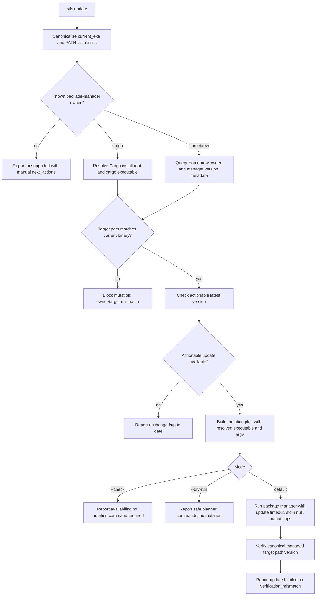

# feat: Add Self-Update Command

## Summary

Add `sifs update` as an explicit package-manager-backed update command for Cargo and Homebrew installs. The first implementation should focus on safe check, dry-run, and mutation behavior with structured JSON output; passive "Update available" notices are deferred until the explicit command has proven safe.

---

## Problem Frame

SIFS is distributed through crates.io and a Homebrew tap, but users currently need to remember the manager-specific update command. A first-class `sifs update` can make the tool easier to keep current without taking on the risk of a custom binary self-replacer.

---

## Requirements

- R1. Provide a top-level `sifs update` command that can check the current installed version against an actionable latest version.
- R2. Support explicit update execution for the documented install surfaces: Cargo and Homebrew.
- R3. Provide machine-readable `--json` output for update state, version sources, install ownership, planned commands, blocking conditions, and next actions.
- R4. Make update mutation explicit and previewable; `--check` and `--dry-run` must be distinct contracts.
- R5. Refuse unsupported, copied, ambiguous, dev, or ownership-mismatched install paths instead of mutating a package-manager target that may not own the running binary.
- R6. Resolve and execute package-manager binaries through trusted absolute paths, never through a shell or unvalidated PATH lookup.
- R7. Keep latest-version lookup bounded, test-injectable, and method-aware: Cargo can use crates.io as actionable latest; Homebrew must distinguish manager-available version from upstream crates.io version.
- R8. Update docs, agent contract metadata, changelog, and a narrow release-validation note so the new command is discoverable and maintainable.

---

## Scope Boundaries

- Do not implement a direct GitHub artifact downloader or custom binary replacement mechanism.
- Do not add support for package managers that are not documented SIFS install surfaces.
- Do not add passive startup-time update notices in v1.
- Do not let cached latest-version data trigger explicit mutation unless the implementation adds a deliberate cache-only/offline mode with clear JSON semantics.
- Do not require network access or real package-manager mutation in default tests.
- Do not turn this into release automation for crates.io, GitHub releases, or the Homebrew tap.

### Deferred to Follow-Up Work

- Passive update-available notices: add only after `sifs update` ships, with an explicit allowlist of human commands, cache-only/default-quiet behavior, and exhaustive structured-output suppression tests.
- Persistent latest-version cache for passive checks: defer schema/freshness complexity until passive notices exist. A minimal explicit-check cache is optional, but not required for v1.
- Fully automated release publishing: separate release-infrastructure work if manual release steps become too costly.
- Support for additional package managers or standalone prebuilt binaries: future distribution work after those install surfaces exist.
- Strong post-update smoke checks beyond target-binary version verification: optional follow-up if update failures are observed in the wild.

---

## Context & Research

### Relevant Code and Patterns

- `src/main.rs` owns the Clap command tree, command dispatch, JSON/human rendering, external command execution helpers, MCP install checks, and daemon/model/cache command handlers.
- `src/main.rs` already has a `stable_binary_path` heuristic and `warn_if_development_binary` for refusing durable MCP config from `target/debug` or `target/release` binaries.
- `src/agent_context.rs` emits the machine-readable command contract used by agents.
- `tests/cli.rs` uses `env!("CARGO_BIN_EXE_sifs")`, tempdirs, fake environment state, and JSON parsing assertions for CLI behavior. Because `std::env::current_exe()` points at Cargo's test binary, CLI tests need explicit injection seams for install-path simulation.
- `README.md`, `docs/cli.md`, and `RELEASING.md` document install, CLI, and release workflows.
- `packaging/homebrew/sifs.rb` demonstrates the Homebrew formula install path and should be treated as packaging source, not proof that the published tap is current.

### Institutional Learnings

- Prior Homebrew verification for SIFS found that installed artifacts matter more than local formula templates; verify the real `sifs` binary and an offline/MCP smoke path when validating distribution changes.
- Existing SIFS agent-native plans emphasize parseable stdout for `--json`, diagnostics on stderr, dry-run support for mutation-adjacent commands, and explicit state values such as `planned`, `updated`, `unchanged`, `unsupported`, and `failed`.
- Prior MCP work showed that configured, installed, and working need to be separate states. The update command should similarly distinguish install-method detection, ownership gating, latest-version lookup, package-manager execution, and post-update target verification.

### External References

- Cargo documents `cargo install` as a system/user-level binary install command and supports `--force` to overwrite existing installed binaries: [Cargo Book: cargo install](https://doc.rust-lang.org/cargo/commands/cargo-install.html).
- Cargo's install command can use `--locked` to respect the published lockfile; SIFS install docs already recommend `cargo install --locked sifs`.
- Homebrew documents direct tap installs as `brew install user/repository/formula` and says taps update during `brew update`, with outdated formulae upgraded by `brew upgrade`: [Homebrew tap maintenance](https://docs.brew.sh/How-to-Create-and-Maintain-a-Tap).
- Homebrew's manpage notes that `brew install formula` may upgrade an already installed outdated formula unless disabled by environment, but an explicit update command should prefer a clear `brew upgrade` flow: [Homebrew manpage](https://docs.brew.sh/Manpage).
- crates.io data access policy requires a specific user-agent and limits API clients to at most one request per second; SIFS should set an identifying user-agent and avoid repeated automatic requests: [crates.io policy RFC](https://rust-lang.github.io/rfcs/3463-crates-io-policy-update.html).
- The crates.io package index is also available through the sparse HTTP index and git repository; direct API lookup is acceptable for a single crate if user-agent, timeout, and test injection discipline are respected: [crates.io package index](https://index.crates.io/).

---

## Key Technical Decisions

- Delegate updates to package managers: `sifs update` should call Cargo or Homebrew only when that manager is proven to own the current executable. This avoids fragile custom self-replacement and prevents mutating a different install root.
- Split status from mutation: `sifs update --check` answers whether an actionable update exists; `sifs update --dry-run` answers what mutation would run and whether it is safe to run. JSON must not collapse those into one `would_change` boolean.
- Introduce a focused update module: Put install ownership detection, latest-version providers, semver comparison, command planning, runner abstractions, and result structs in `src/update.rs`; keep `src/main.rs` focused on Clap wiring and rendering.
- Use method-aware latest versions: Cargo installs use crates.io as `actionable_latest_version`; Homebrew installs use Homebrew/tap metadata as `manager_available_version` and may report crates.io as `upstream_latest_version`.
- Require ownership/provenance gates before mutation: canonicalize the running executable, resolve PATH-visible `sifs`, identify the package-manager target path, and refuse mutation unless the target path matches the running binary or a documented symlink chain.
- Resolve package-manager executables to trusted absolute paths: execution must use `Command::new(resolved_path)` with argv only, never a shell; dry-run/JSON should include the resolved executable path.
- Define command execution budgets separately: latest-version metadata lookups get a short bounded timeout; package-manager mutation gets a longer update timeout and a kill-on-timeout runner with output-size caps.
- Keep passive notices out of v1: update-available startup UX is useful but cross-cutting; it should be a follow-up built on the explicit command and an allowlist-based quiet-by-default policy.

---

## Open Questions

### Resolved During Planning

- Direct self-replacement versus package-manager delegation: Delegate to Cargo/Homebrew to avoid platform-specific executable replacement and provenance risks.
- Passive notice priority: Defer passive notices from v1 because they widen the blast radius across every normal CLI invocation.
- Cargo latest-version source: Use crates.io as the actionable source for Cargo installs.
- Homebrew latest-version source: Use Homebrew manager metadata as the actionable source and report crates.io only as upstream context.

### Deferred to Implementation

- Exact HTTP transport: Choose a direct dependency during implementation, but the implementation must add direct `semver`, use an explicit user-agent, support timeout, and allow tests to inject responses without network.
- Exact Homebrew metadata commands: Select from `brew info --json=v2`, `brew list --formula --versions`, `brew outdated --json`, and `brew --prefix` based on reliable ownership detection; the chosen sequence must produce the states required by this plan before mutation.
- Exact internal environment override names: Define test-only or internal environment hooks in implementation, but the CLI must have a documented test seam for current executable path, latest-version provider, runner log, and cache/root isolation.

---

## High-Level Technical Design

> *This illustrates the intended approach and is directional guidance for review, not implementation specification. The implementing agent should treat it as context, not code to reproduce.*

---

## Implementation Units

- U1. **Add Update Domain and Safety Model**

**Goal:** Create the internal update state machine, safety gates, and testable data types without CLI mutation.

**Requirements:** R1, R2, R3, R5, R6, R7

**Dependencies:** None

**Files:**
- Create: `src/update.rs`
- Modify: `src/lib.rs`
- Test: `src/update.rs`

**Approach:**
- Define install owners, ownership evidence, latest-version sources, command plans, blocking conditions, runner outputs, update statuses, warnings, and next-action fields.
- Implement pure helpers for semver comparison, canonical path comparison, dev/unknown classification, and safe command planning.
- Use deterministic owner detection rather than a generalized confidence model: known Homebrew prefix/Cellar/opt ownership, Cargo install-root ownership, dev build paths, otherwise unsupported.
- Require mutation gates that prove the package-manager target path matches the canonical running executable or a documented symlink target.
- Model Homebrew states separately from Cargo: `manager_available_version`, `upstream_latest_version`, `manager_not_yet_available`, `homebrew_owner_mismatch`, `homebrew_pinned`, and similar states are first-class.
- Add an explicit test environment abstraction so unit and CLI tests can supply current executable paths, PATH-visible `sifs`, latest-version responses, package-manager metadata, and runner outputs without real package-manager mutation.

**Patterns to follow:**
- `src/agent_installer.rs` for structured mutation report types and status vocabulary.
- `src/main.rs` stable-binary checks for development path detection.
- `src/feedback.rs` and profile/cache modules for platform-root test isolation patterns.

**Test scenarios:**
- Happy path: Cargo-owned executable under effective Cargo install root and newer crates.io version -> mutation allowed and Cargo command plan is produced.
- Happy path: Homebrew-owned executable under resolved Homebrew prefix/Cellar path and newer manager version -> mutation allowed and Homebrew command plan is produced.
- Edge case: crates.io is newer but Homebrew manager metadata is not -> no actionable Homebrew update; JSON reports upstream newer than package manager.
- Edge case: current version equals actionable latest -> status is unchanged and no mutation command is required.
- Error path: dev binary from Cargo `target` tree -> mutation is unsupported with install guidance.
- Error path: copied binary or PATH-shadowed binary -> mutation is blocked with ownership evidence and next actions.
- Error path: `CARGO_HOME` or `CARGO_INSTALL_ROOT` points to a target that does not match the current binary -> mutation is blocked.
- Error path: malformed, non-semver, prerelease-if-unsupported, or missing latest-version data -> explicit warning/error state without panic.

**Verification:**
- Unit tests exercise owner detection, path canonicalization, target equivalence, version comparison, manager-specific latest semantics, command planning, and unsupported states without network or real package managers.

---

- U2. **Implement Version Providers and Package-Manager Runner**

**Goal:** Add bounded latest-version lookup and safe package-manager execution primitives.

**Requirements:** R1, R3, R6, R7

**Dependencies:** U1

**Files:**
- Modify: `Cargo.toml`
- Modify: `Cargo.lock`
- Modify: `src/update.rs`
- Test: `src/update.rs`

**Approach:**
- Add direct `semver` and a selected direct HTTP dependency or sparse-index reader that supports timeout and a SIFS-specific user-agent.
- Keep crates.io lookup specific to the SIFS crate and injectable in tests.
- Add Homebrew metadata provider abstraction that can parse manager-owned installed/latest state from resolved Homebrew commands.
- Resolve `cargo`/`brew` executables to absolute paths and reject suspicious or owner-inconsistent resolutions before mutation.
- Add a package-manager runner with stdin null, no shell, captured stdout/stderr with output caps, kill-on-timeout behavior, and stage-specific failure classification.
- Use separate budgets for metadata lookup and update mutation; do not reuse the existing 30-second daemon/MCP timeout as the mutation default.
- Capture relevant environment influences in JSON/dry-run, especially `PATH`, `CARGO_HOME`, `CARGO_INSTALL_ROOT`, `RUSTUP_HOME`, `RUSTC_WRAPPER`, `CARGO_TARGET_DIR`, and Homebrew variables that materially affect target paths.

**Patterns to follow:**
- Existing `ProcessCommand` use in `src/main.rs`, but wrap it with timeout/output-limit semantics rather than calling `.output()` directly for package-manager mutation.
- crates.io API policy requirements for user-agent and rate discipline.

**Test scenarios:**
- Happy path: fake crates.io provider returns a newer semver for Cargo -> actionable latest is newer.
- Happy path: fake Homebrew metadata reports newer manager version -> actionable latest is manager version, with crates.io as upstream context when present.
- Edge case: crates.io lookup fails during `--check` -> JSON reports lookup failure with next actions and no mutation plan.
- Edge case: Homebrew manager version lags crates.io -> JSON reports `manager_not_yet_available` or equivalent and does not mark mutation failure.
- Error path: fake `cargo` or `brew` earlier in PATH is rejected when inconsistent with detected owner.
- Error path: package-manager runner times out -> process is killed and JSON reports timeout stage and elapsed time.
- Error path: runner output exceeds cap -> output is truncated with metadata, not unbounded.

**Verification:**
- Provider and runner tests prove latest lookup, Homebrew/Cargo source split, trusted executable resolution, timeout handling, and output capping without live network or package-manager calls.

---

- U3. **Wire `sifs update` CLI Contract**

**Goal:** Add the public command, human output, JSON output, check/dry-run behavior, mutation execution, and post-update target verification.

**Requirements:** R1, R2, R3, R4, R5, R6, R7

**Dependencies:** U1, U2

**Files:**
- Modify: `src/main.rs`
- Test: `tests/cli.rs`

**Approach:**
- Add `Command::Update` with `--check`, `--dry-run`, `--json`, and an update-specific timeout option or documented internal update timeout.
- `--check` should report version availability and blocking conditions; it does not require a safe mutation plan.
- `--dry-run` should validate ownership enough to produce a safe command plan or return unsupported/blocked; it should not mutate and should not require package-manager execution.
- Default `sifs update` should only mutate when ownership and manager executable checks pass.
- Verify the canonical managed target path after mutation, not bare `sifs` from PATH. If useful, also report PATH-visible version separately.
- JSON should distinguish `update_available`, `actionable_update_available`, `mutation_supported`, `planned_commands`, `blocking_conditions`, `current_exe`, `canonical_exe`, `path_sifs`, `planned_target`, `target_matches_current`, `manager_available_version`, `upstream_latest_version`, `verified_target_path`, and `verification_status`.
- Human output should be concise and should point unsupported users to exact manual Cargo/Homebrew commands without claiming mutation happened.

**Patterns to follow:**
- `run_daemon_command`, `install_launch_agent`, `run_cache`, and `run_agent` in `src/main.rs` for command dispatch and JSON/human split.
- `tests/cli.rs` integration-test style using tempdirs and `serde_json::Value`; use update-specific environment/test seams rather than relying only on fake PATH.

**Test scenarios:**
- Happy path: `sifs update --check --json` with injected Cargo owner and newer crates.io version reports actionable update available and parseable JSON.
- Happy path: `sifs update --dry-run --json` with injected Cargo owner reports mutation-supported planned Cargo command without executing it.
- Happy path: `sifs update --dry-run --json` with injected Homebrew owner reports manager-based planned Homebrew command without executing it.
- Edge case: `--check --json` with newer crates.io but unknown install reports version availability but `mutation_supported: false`.
- Edge case: Homebrew manager metadata is stale while crates.io is newer -> `--check --json` reports upstream newer but no actionable manager update.
- Error path: dev/test binary without override refuses mutation and reports install guidance.
- Error path: ownership target mismatch blocks default mutation before running package-manager command.
- Error path: fake package-manager command exits non-zero -> command exits non-zero and reports structured failure with command context and output cap metadata.
- Integration: `sifs update --help` documents check, dry-run, JSON, and package-manager-backed behavior.

**Verification:**
- CLI tests prove command shape, parseable JSON, unsupported/dev refusal, method-specific dry-run planning, safe mutation blocking, and fake command failure without real network or package-manager mutation.

---

- U4. **Expose Update Capability to Agents and Documentation**

**Goal:** Make the explicit update surface discoverable to humans, agents, and maintainers.

**Requirements:** R3, R8

**Dependencies:** U3

**Files:**
- Modify: `src/agent_context.rs`
- Modify: `README.md`
- Modify: `docs/cli.md`
- Modify: `RELEASING.md`
- Modify: `CHANGELOG.md`
- Test: `tests/cli.rs`

**Approach:**
- Add `update` to `agent-context --json` command metadata with flags, mutation boundary, safety gates, and structured output expectation.
- Update the README install section with `sifs update`, plus explicit Cargo/Homebrew fallback commands for unsupported cases.
- Document `sifs update --check --json` and `sifs update --dry-run --json` in `docs/cli.md` near diagnostics/setup commands.
- Limit `RELEASING.md` to one narrow validation note: after publishing, an installed binary should have `sifs update --check --json` observe the expected actionable version for its manager.
- Add a changelog entry under `Unreleased` for the command.

**Patterns to follow:**
- `src/agent_context.rs` existing command metadata shape.
- `docs/cli.md` diagnostics/setup command documentation.
- `CHANGELOG.md` Keep a Changelog categories and local AGENTS.md changelog discipline.

**Test scenarios:**
- Happy path: `sifs agent-context --json` includes `update` with expected command, flags, mutation boundary, and JSON support metadata.
- Documentation verification: command examples use `--locked` consistently for Cargo and manager-aware Homebrew language.
- Regression: docs do not promise passive update notices in v1.

**Verification:**
- Docs and agent contract agree on the explicit command shape, and tests lock the machine-readable metadata.

---

## System-Wide Impact

- **Interaction graph:** The explicit update command touches CLI dispatch, package-manager execution, version lookup, platform/environment detection, docs, and agent metadata. Normal search/MCP/daemon command startup is intentionally unchanged in v1.
- **Error propagation:** Explicit update failures should be visible and non-zero in mutation mode; `--check` and `--dry-run` should return structured non-mutating states for unsupported or blocked installs.
- **State lifecycle risks:** Package-manager mutation can change the binary on disk but not the running process. Verification must target the canonical managed binary path and report PATH-visible discrepancies separately.
- **API surface parity:** Human CLI, `--json`, `agent-context`, README, CLI docs, and release docs must describe the same update contract.
- **Integration coverage:** Unit tests cover pure update state and safety gates; CLI integration tests cover command shape, JSON parseability, injected install ownership, unsupported installs, and fake runner failures.
- **Unchanged invariants:** Search, daemon, MCP, JSON, JSONL, offline behavior, and normal command stderr should not change because passive notices are deferred.

---

## Risks & Dependencies

| Risk | Mitigation |
|------|------------|
| Install-method detection mutates the wrong target | Require canonical target equivalence and ownership evidence before mutation; otherwise return unsupported/blocked with next actions. |
| PATH hijacking causes execution of malicious `cargo`, `brew`, or `sifs` | Resolve package-manager and verification executables to trusted absolute paths; verify canonical target path, not bare PATH lookup. |
| Homebrew tap lags crates.io | Treat Homebrew manager version as actionable latest and crates.io as upstream context; expose `manager_not_yet_available` or equivalent state. |
| Package-manager update exceeds daemon/MCP timeout | Use update-specific timeout budgets and a kill-on-timeout runner rather than the existing 30-second global default. |
| Tests cannot simulate installed binaries | Add explicit update test seams for current executable, latest-version providers, manager metadata, and runner output. |
| Cache or stale metadata drives unsafe mutation | Do not trust cached latest-version data for mutation in v1; explicit mutation should refresh from the authoritative manager source or return a clear lookup failure. |
| Dependency choice expands binary/platform risk | Add direct dependencies deliberately, document the chosen HTTP/TLS strategy in the implementation PR, and keep provider injection network-free in tests. |

---

## Documentation / Operational Notes

- The implementation PR must update `CHANGELOG.md` with the user-facing command and any docs/agent-contract changes.
- Release validation should include `sifs update --check --json` from an installed binary, but broad tap-freshness process improvements remain outside this plan.
- Passive update notices remain a separate follow-up; `sifs update --check --json` is the authoritative machine-readable status surface.

---

## Sources & References

- Related code: `src/main.rs`
- Related code: `src/update.rs`
- Related code: `src/agent_context.rs`
- Related tests: `tests/cli.rs`
- Related docs: `README.md`
- Related docs: `docs/cli.md`
- Related release docs: `RELEASING.md`
- Related packaging: `packaging/homebrew/sifs.rb`
- Cargo install docs: [https://doc.rust-lang.org/cargo/commands/cargo-install.html](https://doc.rust-lang.org/cargo/commands/cargo-install.html)
- Homebrew tap docs: [https://docs.brew.sh/How-to-Create-and-Maintain-a-Tap](https://docs.brew.sh/How-to-Create-and-Maintain-a-Tap)
- Homebrew manpage: [https://docs.brew.sh/Manpage](https://docs.brew.sh/Manpage)
- crates.io data-access policy RFC: [https://rust-lang.github.io/rfcs/3463-crates-io-policy-update.html](https://rust-lang.github.io/rfcs/3463-crates-io-policy-update.html)
- crates.io package index: [https://index.crates.io/](https://index.crates.io/)
